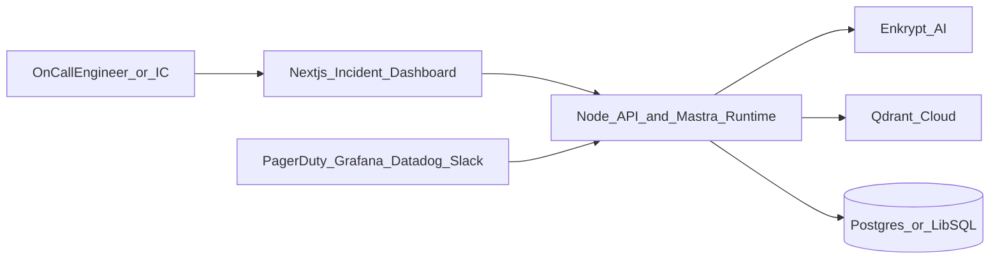
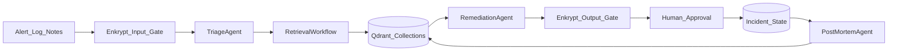
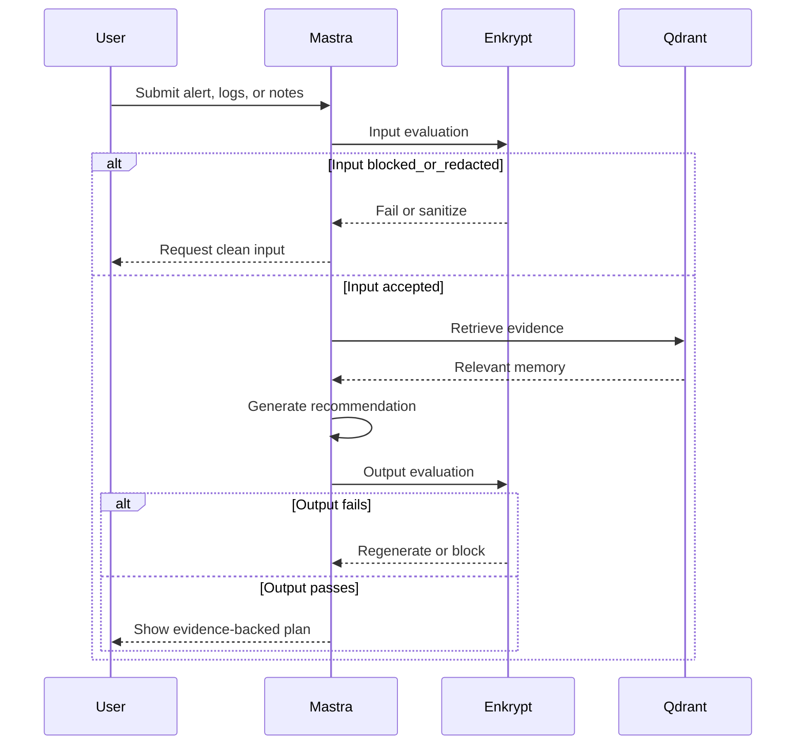
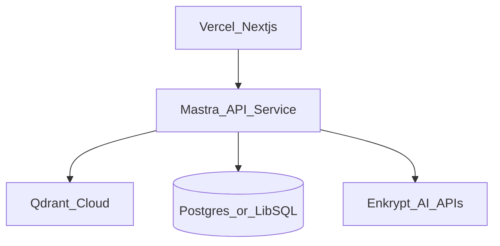

# Runbook Sentinel Architecture

## System Summary
Runbook Sentinel is a full-stack incident response and post-mortem agent built on `Mastra`, `Qdrant`, and `Enkrypt AI`. The system is designed to support active operational workflows rather than generic chat interactions. It ingests incident context, retrieves relevant institutional knowledge, generates evidence-backed remediation guidance, enforces safety checks, and writes resolved incident knowledge back into long-term memory.

The architecture is intentionally optimized for the hackathon judging rubric:

- `Mastra` is the orchestration backbone for agents, workflows, routing, tool calls, and human approval gates.
- `Qdrant` is the memory and retrieval layer for incidents, runbooks, logs, and post-mortems.
- `Enkrypt AI` is the safety and evaluation layer that protects both input handling and final output quality.

## Architecture Principles
1. Every user-visible recommendation must be retrieval-backed.
2. High-risk steps must pass both automated evaluation and human approval.
3. Incident knowledge must compound over time through writeback into Qdrant.
4. The UX should feel like an incident operating system, not a chatbot shell.
5. The stack should remain TypeScript-first across frontend, backend, and orchestration.

## System Context


## High-Level Data Flow


## Frontend Architecture
The frontend is a `Next.js` and React application that presents a structured incident workspace instead of a free-form chat UI.

### Primary Screens
- `Incident Room`: active incident summary, current status, retrieved evidence, remediation plan, and approval queue
- `Timeline View`: ordered list of alerts, notes, decisions, recommendations, and approvals
- `Evidence Panel`: similar incidents, runbook excerpts, and supporting log patterns
- `Post-Mortem Editor`: editable draft with sections for impact, timeline, root cause, and action items

### Frontend Responsibilities
- Capture alert or log input
- Display workflow status and pending approval checkpoints
- Show citations attached to recommendations
- Render Enkrypt evaluation status for transparency
- Support post-mortem review and finalization

## Backend Architecture
The backend is a TypeScript service that hosts both the application API and the Mastra runtime. It owns incident state, workflow triggering, retrieval orchestration, Enkrypt integration, and writeback into Qdrant.

### Core Responsibilities
- Create and update incident records
- Start Mastra workflows from API requests or webhook events
- Manage workflow suspension and resume events for approvals
- Translate user inputs into retrieval and generation tasks
- Persist metadata, audit events, and workflow state
- Coordinate reads and writes across Qdrant and Enkrypt AI

## Mastra Orchestration Layer
Mastra is the central execution system. The product is modeled as a set of specialized agents coordinated by durable workflows.

### Agents
| Agent | Responsibility | Inputs | Outputs |
|---|---|---|---|
| `TriageAgent` | Classifies severity, blast radius, and likely subsystem | Alert payload, logs, notes | Incident summary, service guess, severity, likely issue family |
| `RetrievalAgent` | Queries Qdrant collections and ranks relevant evidence | Structured incident context | Similar incidents, runbook chunks, log signatures, post-mortem snippets |
| `RemediationAgent` | Produces investigation and mitigation recommendations | Triage result plus retrieval evidence | Ranked plan with rationale, confidence, and citations |
| `PostMortemAgent` | Drafts retrospective and action items | Incident timeline, final notes, evidence, approvals | Post-mortem draft and memory writeback payload |

### Tools
The first implementation should include a narrow, production-minded toolset:

- `fetchDashboardLinks`: returns service-specific Grafana or Datadog links
- `queryIncidentMemory`: queries Qdrant incident and post-mortem collections
- `queryRunbookMemory`: retrieves runbook passages and supporting procedures
- `appendIncidentTimeline`: writes events into incident state storage
- `submitForApproval`: creates approval tasks for risky recommendations
- `storeResolvedIncident`: writes finalized incident summaries and post-mortems back into Qdrant

### Workflows
#### 1. `incident-response`
Purpose: orchestrate the live response path from intake through guidance.

Stages:
1. Receive incident context
2. Run Enkrypt input evaluation
3. Invoke `TriageAgent`
4. Branch by severity
5. Run retrieval workflow
6. Invoke `RemediationAgent`
7. Run Enkrypt output evaluation
8. Suspend for approval if high-risk actions are present
9. Resume and append timeline events

Key Mastra features highlighted:
- conditional branching by severity
- tool calls for retrieval and state updates
- suspend and resume for human-in-the-loop approval
- durable workflow state for reliability

#### 2. `evidence-retrieval`
Purpose: gather evidence from multiple Qdrant collections in parallel.

Stages:
1. Build retrieval query from triage output
2. Query `incidents`
3. Query `runbooks`
4. Query `log_chunks`
5. Optionally query `post_mortems`
6. Merge and rank evidence

Key Mastra features highlighted:
- parallel steps
- typed outputs between retrieval stages
- explicit orchestration over multi-source context assembly

#### 3. `post-mortem-generation`
Purpose: convert the resolved incident into a structured retrospective and memory artifact.

Stages:
1. Trigger on incident resolution
2. Gather timeline, notes, decisions, and evidence
3. Invoke `PostMortemAgent`
4. Run Enkrypt output evaluation for relevancy and adherence
5. Save editable draft
6. On final approval, write memory payloads to Qdrant

Key Mastra features highlighted:
- event-driven workflow trigger
- handoff from active incident workflow to retrospective generation
- repeatable writeback to shared memory

### Supervisor Pattern
The system can use the API layer as the incident coordinator while Mastra manages agent-level execution, or it can optionally introduce a lightweight supervisor agent in later rounds. For Round 1, the cleaner architecture is specialized workflows plus well-scoped agents, because that makes orchestration depth easier for judges to reason about.

### Why Mastra Matters Here
This architecture depends on capabilities that are central to Mastra:
- branching logic instead of a single prompt chain
- tool-driven execution instead of static RAG
- workflow durability instead of ephemeral inference
- human approval checkpoints instead of blind automation
- agent specialization with traceability in Mastra Studio

## Qdrant Memory and Retrieval Layer
Qdrant is the long-term operational memory system. It stores embeddings and metadata for all domain artifacts that should be recalled during incident response.

### Collections
#### `incidents`
Stores structured summaries of prior incidents.

Suggested payload schema:
```json
{
  "id": "inc_2026_001",
  "service": "checkout-api",
  "environment": "prod",
  "severity": "SEV2",
  "summary": "Spike in 5xx responses after deploy",
  "symptoms": ["error_rate_increase", "latency_spike"],
  "resolution": "rollback deployment and flush bad cache",
  "timestamp": "2026-06-18T09:10:00Z"
}
```

#### `runbooks`
Stores chunked operational runbooks and service procedures.

Suggested payload schema:
```json
{
  "id": "rb_checkout_rollback_01",
  "service": "checkout-api",
  "title": "Checkout rollback procedure",
  "section": "rollback_steps",
  "source": "internal_runbook",
  "text": "Verify canary error rate before promoting rollback globally."
}
```

#### `log_chunks`
Stores semantically meaningful log segments rather than raw full files.

Suggested payload schema:
```json
{
  "id": "log_2026_06_18_001",
  "incident_id": "inc_2026_001",
  "service": "checkout-api",
  "environment": "prod",
  "error_signature": "db_pool_exhausted",
  "time_window": "2026-06-18T09:00Z/2026-06-18T09:05Z",
  "log_text": "timeout acquiring connection from pool"
}
```

#### `post_mortems`
Stores final retrospective knowledge.

Suggested payload schema:
```json
{
  "id": "pm_2026_001",
  "incident_id": "inc_2026_001",
  "service": "checkout-api",
  "root_cause": "connection pool exhaustion after traffic surge",
  "timeline": "09:00 alert triggered; 09:08 rollback approved; 09:13 recovery confirmed",
  "action_items": ["increase pool limits", "add saturation alert"]
}
```

### Retrieval Strategy
The system uses a blend of semantic search and metadata filtering.

- Semantic similarity finds prior incidents that are behaviorally similar even when exact wording differs.
- Metadata filters narrow the search to the right service, environment, timeframe, or severity.
- Retrieval results are re-ranked before being sent to the remediation layer.

Example query patterns:
- `checkout-api + SEV2 + last 90 days`
- `db_pool_exhausted + prod`
- `latency spike after deploy`

### Chunking Strategy
#### Runbooks
- Chunk by procedure section, not arbitrary token count
- Preserve titles and section labels in metadata
- Favor chunks that map to actual operator actions

#### Logs
- Group by time window and repeated error signature
- Preserve incident ID, service, and environment metadata
- Remove obvious secrets or sensitive values before embedding

#### Post-Mortems
- Chunk by timeline, root cause, lessons learned, and action items
- Preserve service and incident taxonomy for better filtering

### Write Path
Qdrant is not just a read layer. Every resolved incident improves future performance.

Writeback flow:
1. Incident closes
2. Post-mortem is drafted and approved
3. Structured summary is generated
4. New incident, log pattern, and post-mortem payloads are upserted into Qdrant

This turns the system into compounding institutional memory rather than a stateless assistant.

### Mastra + Qdrant Integration
The intended implementation uses Mastra's Qdrant integration with semantic retrieval and memory features. The architecture assumes:

- `QdrantVector` for vector storage access
- service-specific metadata filters
- semantic recall for incident conversation context
- shared retrieval utilities for both live guidance and post-mortem generation

## Enkrypt AI Safety and Evaluation Layer
Enkrypt AI sits in front of both user input and model output. In this product, it is a hard production gate rather than a decorative safety layer.

## Evaluation Pipeline


### Input Guardrails
Use Enkrypt detectors to validate incoming text before it reaches the reasoning path.

Primary checks:
- prompt injection detection
- PII detection or anonymization
- policy violation checks for unsafe or irrelevant content

Why it matters:
- logs and pasted notes can contain secrets, credentials, or misleading attacker-crafted content
- the system should never embed or store unsafe raw content without inspection

### Output Guardrails
Use Enkrypt evaluation to validate the final recommendation package before it is rendered in the UI.

Primary checks:
- adherence to retrieved context
- relevancy to the active incident
- toxicity or policy violation as needed
- optional hallucination detector when generally available

Output gating policy:
- block remediation steps that do not cite retrieved evidence
- block recommendations whose relevance score is below threshold
- require regeneration when the response overstates certainty

### Guardrail Configuration Strategy
Saved guardrails should be configured for two distinct phases:

1. `incident_input_guardrail`
   - injection detection enabled
   - PII detection enabled
   - optional redaction before storage

2. `incident_output_guardrail`
   - adherence and relevancy enabled
   - policy rule requiring evidence-backed recommendations
   - block mode for unsupported high-risk output

### Auditability
Every Enkrypt decision should be stored with:
- incident ID
- detector names used
- pass or fail state
- returned scores where available
- timestamp and associated workflow step

This gives the demo a strong production-readiness story and supports later analytics.

## Incident State and Relational Storage
While Qdrant stores semantic memory, relational storage is still useful for operational state.

Recommended tables:
- `incidents`
- `incident_events`
- `approvals`
- `workflow_runs`
- `enkrypt_evaluations`
- `post_mortem_drafts`

Recommended use:
- `Postgres` for a production-ready path
- `LibSQL` or SQLite-compatible local storage for a simpler hackathon setup

## API Surface
The backend should expose a small, focused API.

### Core Endpoints
- `POST /api/incidents`
  - create a new incident
- `POST /api/incidents/:id/analyze`
  - trigger or resume the main incident workflow
- `GET /api/incidents/:id`
  - fetch structured incident detail
- `GET /api/incidents/:id/timeline`
  - fetch timeline events
- `POST /api/incidents/:id/approve-step`
  - approve or reject a risky action
- `POST /api/incidents/:id/postmortem`
  - generate or regenerate post-mortem draft
- `POST /api/incidents/:id/finalize`
  - finalize incident and trigger writeback

### Event Delivery
- Server-Sent Events or WebSockets can stream timeline updates, retrieval progress, and approval requests to the frontend.

## Deployment Architecture


### Recommended Deployment Split
- Frontend: `Vercel`
- API and Mastra runtime: `Cloud Run`, `Railway`, or `Fly.io`
- Vector database: `Qdrant Cloud`
- Relational state: managed `Postgres` or lightweight `LibSQL`

### Environment Variables
- `QDRANT_URL`
- `QDRANT_API_KEY`
- `ENKRYPTAI_API_KEY`
- `DATABASE_URL`
- `OPENAI_API_KEY` or provider-specific model keys
- Mastra workflow and app-level configuration variables as needed

## Observability and Reliability
The hackathon build should still look production-conscious.

Recommended observability:
- workflow run logs
- retrieval latency and result counts
- Enkrypt pass or fail rates
- approval wait time
- post-mortem generation success rate

Failure handling:
- if Enkrypt input check fails, request sanitized input
- if retrieval fails, return constrained fallback behavior rather than unsupported recommendations
- if approval times out, keep the incident open with a pending state

## MVP vs Stretch Scope
### MVP
- manual incident intake
- service-aware triage
- Qdrant retrieval over seeded incidents and runbooks
- evidence-backed remediation recommendations
- approval gate for risky steps
- post-mortem draft generation

### Stretch
- PagerDuty or Opsgenie webhook ingestion
- Datadog or Grafana deep links
- Slack incident room updates
- live log tail tool
- Enkrypt red-team report for final submission

## Demo and Seed Data Strategy
To make the Round 2 and Round 3 path credible, the demo needs realistic but controllable operational data.

### Seed Dataset Plan
Create 10 to 20 fictional but realistic incidents across a small set of services:
- `checkout-api`
- `payments-worker`
- `catalog-api`
- `auth-service`
- `redis-cache`

For each seeded incident include:
- title and summary
- severity
- service and environment
- timeline highlights
- key symptoms
- final resolution
- follow-up action items

### Runbook Seed Plan
Create runbooks for common failure modes:
- deployment rollback
- cache stampede mitigation
- database connection pool saturation
- dependency timeout handling
- queue backlog recovery

### Log Seed Plan
Use either public examples or synthetic JSON logs that contain:
- timestamps
- service names
- error signatures
- trace IDs
- status codes
- latency or timeout messages

### Candidate Public Sources
- LogHub or similar open log datasets
- HDFS or Hadoop sample logs
- synthetic traces generated from common microservice failure patterns

### Golden Demo Scenario
Use a scripted `checkout-api` degradation incident:
1. Alert shows elevated 5xx rate after deploy
2. Logs indicate connection pool exhaustion
3. Qdrant retrieves a prior similar incident and rollback runbook
4. Remediation agent recommends rollback and connection pool verification
5. Enkrypt validates the output
6. Human approves the high-risk step
7. Timeline updates and post-mortem draft is generated

This scenario is simple enough to demo reliably but rich enough to showcase all three mandatory technologies.

## Repository Structure
Recommended project layout:

```text
mastra-hktn/
  docs/
    PRD.md
    ARCHITECTURE.md
  apps/
    web/
    api/
  src/
    mastra/
      agents/
      workflows/
      tools/
    lib/
      enkrypt/
      qdrant/
      incidents/
```

## Why This Architecture Is Strong for Judging
- `Mastra Integration Depth`: multiple specialized agents, parallel retrieval, branching logic, workflow persistence, and human approval are all first-class.
- `Qdrant Integration Quality`: memory is central to the product, with explicit collections, retrieval logic, and writeback loops.
- `Enkrypt AI Coverage`: safety is enforced on both input and output paths, with auditability and policy-driven blocking.
- `Agent Output Quality`: outputs are evidence-backed and context-checked before display.
- `Problem Impact and Novelty`: incident response is high-value, credibility-heavy, and well-suited to a production-oriented agent architecture.
