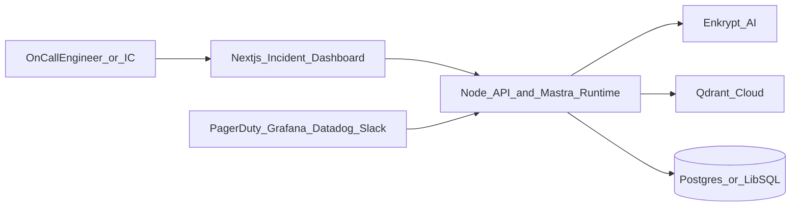
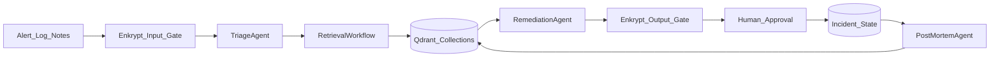
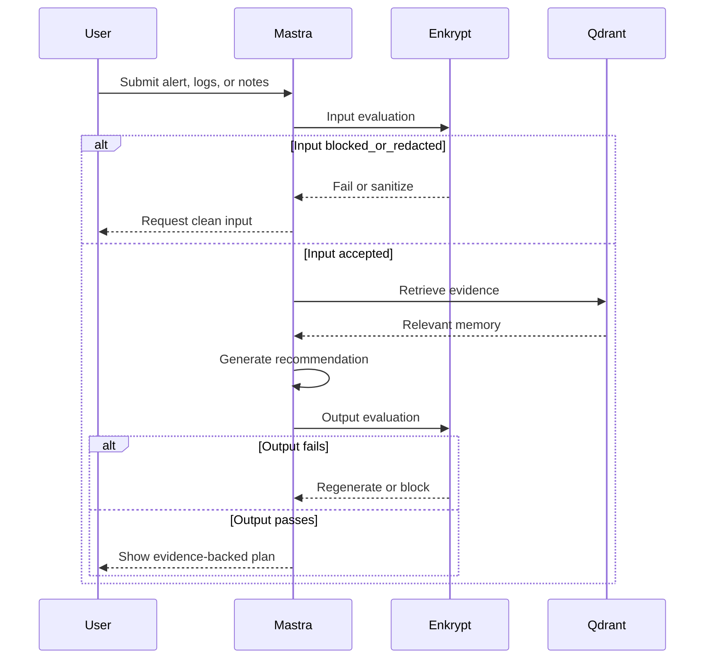
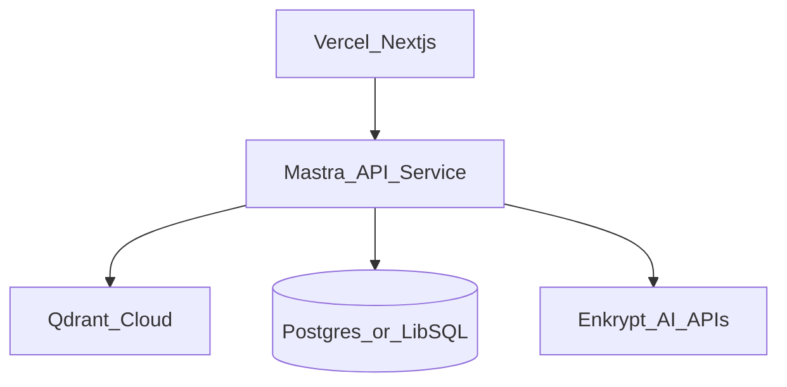

# Runbook Sentinel Architecture

## System Summary
Runbook Sentinel is a full-stack incident response and post-mortem agent built on `Mastra`, `Qdrant`, and `Enkrypt AI`. The system is designed to support active operational workflows rather than generic chat interactions. It ingests incident context, retrieves relevant institutional knowledge, generates evidence-backed remediation guidance, enforces safety checks, and writes resolved incident knowledge back into long-term memory.

The architecture is intentionally optimized for the hackathon judging rubric:

- `Mastra` is the orchestration backbone for agents, workflows, routing, tool calls, and human approval gates.
- `Qdrant` is the memory and retrieval layer for incidents, runbooks, logs, and post-mortems.
- `Enkrypt AI` is the safety and evaluation layer that protects both input handling and final output quality.

## Architecture Principles
1. Every user-visible recommendation must be retrieval-backed.
2. High-risk steps must pass both automated evaluation and human approval.
3. Incident knowledge must compound over time through writeback into Qdrant.
4. The UX should feel like an incident operating system, not a chatbot shell.
5. The stack should remain TypeScript-first across frontend, backend, and orchestration.

## System Context


## High-Level Data Flow


## Frontend Architecture
The frontend is a `Next.js` and React application that presents a structured incident workspace instead of a free-form chat UI.

### Primary Screens
- `Incident Room`: active incident summary, current status, retrieved evidence, remediation plan, and approval queue
- `Timeline View`: ordered list of alerts, notes, decisions, recommendations, and approvals
- `Evidence Panel`: similar incidents, runbook excerpts, and supporting log patterns
- `Post-Mortem Editor`: editable draft with sections for impact, timeline, root cause, and action items

### Frontend Responsibilities
- Capture alert or log input
- Display workflow status and pending approval checkpoints
- Show citations attached to recommendations
- Render Enkrypt evaluation status for transparency
- Support post-mortem review and finalization

## Backend Architecture
The backend is a TypeScript service that hosts both the application API and the Mastra runtime. It owns incident state, workflow triggering, retrieval orchestration, Enkrypt integration, and writeback into Qdrant.

### Core Responsibilities
- Create and update incident records
- Start Mastra workflows from API requests or webhook events
- Manage workflow suspension and resume events for approvals
- Translate user inputs into retrieval and generation tasks
- Persist metadata, audit events, and workflow state
- Coordinate reads and writes across Qdrant and Enkrypt AI

## Mastra Orchestration Layer
Mastra is the central execution system. The product is modeled as a set of specialized agents coordinated by durable workflows.

### Agents
| Agent | Responsibility | Inputs | Outputs |
|---|---|---|---|
| `TriageAgent` | Classifies severity, blast radius, and likely subsystem | Alert payload, logs, notes | Incident summary, service guess, severity, likely issue family |
| `RetrievalAgent` | Queries Qdrant collections and ranks relevant evidence | Structured incident context | Similar incidents, runbook chunks, log signatures, post-mortem snippets |
| `RemediationAgent` | Produces investigation and mitigation recommendations | Triage result plus retrieval evidence | Ranked plan with rationale, confidence, and citations |
| `PostMortemAgent` | Drafts retrospective and action items | Incident timeline, final notes, evidence, approvals | Post-mortem draft and memory writeback payload |

### Citation and Evidence Linking
The RemediationAgent receives retrieved Qdrant results as structured context, where each evidence item includes its Qdrant point ID and collection origin. The agent's output schema enforces a required `evidence_refs` field:

```typescript
const remediationOutputSchema = z.object({
  steps: z.array(z.object({
    action: z.string(),
    risk_level: z.enum(['diagnostic', 'mitigating', 'high_risk']),
    rationale: z.string(),
    confidence: z.number().min(0).max(1),
    evidence_refs: z.array(z.string()).min(1),  // e.g. ["inc_2026_001", "rb_checkout_rollback_01"]
  })),
  overall_hypothesis: z.string(),
});
```

Evidence linking is enforced at three levels:
1. **Schema validation**: the Zod schema rejects outputs with an empty `evidence_refs` array
2. **Output guardrail**: Enkrypt Adherence detector compares the recommendation text against the retrieved evidence passed as `context`, flagging recommendations that diverge from source material
3. **Frontend rendering**: each citation in `evidence_refs` renders as a clickable link in the Evidence Panel, allowing the engineer to verify the source before acting

### Tools
The first implementation should include a narrow, production-minded toolset:

- `fetchDashboardLinks`: returns service-specific Grafana or Datadog links
- `queryIncidentMemory`: queries Qdrant incident and post-mortem collections
- `queryRunbookMemory`: retrieves runbook passages and supporting procedures
- `appendIncidentTimeline`: writes events into incident state storage
- `submitForApproval`: creates approval tasks for risky recommendations
- `storeResolvedIncident`: writes finalized incident summaries and post-mortems back into Qdrant

### Workflows
#### 1. `incident-response`
Purpose: orchestrate the live response path from intake through guidance.

Stages:
1. Receive incident context
2. Run Enkrypt input evaluation
3. Invoke `TriageAgent`
4. Branch by severity
5. Run retrieval workflow
6. Invoke `RemediationAgent`
7. Run Enkrypt output evaluation
8. Suspend for approval if the RemediationAgent output contains at least one step with `risk_level: 'high_risk'` — the workflow step calls `suspend()` with the pending high-risk steps as the suspension payload, persisting state until the engineer approves or rejects via the API
9. Resume on approval and append timeline events; on rejection, loop back to step 6 with engineer feedback as additional context

Key Mastra features highlighted:
- conditional branching by severity
- tool calls for retrieval and state updates
- suspend and resume for human-in-the-loop approval
- durable workflow state for reliability

#### 2. `evidence-retrieval`
Purpose: gather evidence from multiple Qdrant collections in parallel.

Stages:
1. Build retrieval query from triage output (extract service name, error signatures, severity, and semantic summary)
2. Query `incidents` (dense semantic search with service and severity metadata filters)
3. Query `runbooks` (dense semantic search with service metadata filter)
4. Query `log_chunks` (hybrid search: dense + sparse BM25 with Reciprocal Rank Fusion — see Hybrid Search section below)
5. Query `post_mortems` (mandatory for SEV1/SEV2 incidents, optional for lower severity)
6. Merge and re-rank evidence using a weighted fusion strategy:
   - **Score normalization**: normalize similarity scores from each collection to a common 0–1 scale since different collections produce different score distributions
   - **Service-name boost**: exact service match receives a +0.15 additive boost to the normalized score
   - **Freshness weighting**: apply exponential decay based on incident age (half-life of 90 days) so recent incidents rank above stale ones with similar semantic scores
   - **Severity alignment**: incidents matching the active severity level receive a +0.10 boost
   - The final ranked evidence list is capped at top-15 results and passed to the RemediationAgent as structured context including Qdrant point IDs

Key Mastra features highlighted:
- parallel steps across four Qdrant collections
- typed outputs between retrieval stages
- explicit orchestration over multi-source context assembly
- deterministic re-ranking logic applied before agent handoff

#### 3. `post-mortem-generation`
Purpose: convert the resolved incident into a structured retrospective and memory artifact.

Stages:
1. Trigger on incident resolution
2. Gather timeline, notes, decisions, and evidence
3. Invoke `PostMortemAgent`
4. Run Enkrypt output evaluation for relevancy and adherence
5. Save editable draft
6. On final approval, write memory payloads to Qdrant

Key Mastra features highlighted:
- event-driven workflow trigger
- handoff from active incident workflow to retrospective generation
- repeatable writeback to shared memory

### Supervisor Agent Pattern
The four specialized agents (Triage, Retrieval, Remediation, PostMortem) are natural candidates for Mastra's **Supervisor Agent** pattern, where a parent agent receives subagents via its `agents: {}` property and coordinates delegation through its own instructions using `.stream()` or `.generate()` with `maxSteps`.

For Round 1, the architecture uses **explicit workflows as the coordination layer** because it makes orchestration depth, branching logic, and HITL gates easier to trace and debug. Each workflow step is a named, auditable unit that maps directly to the judging rubric.

The intended evolution path for Round 2 introduces a `IncidentSupervisorAgent` that wraps all four agents:

```typescript
const triageAgent = new Agent({
  name: 'triage-agent',
  description: 'Classifies incident severity, blast radius, and likely subsystem from alert payloads, logs, and notes.',
  instructions: `Analyze the incoming incident context and produce a structured triage...',
  model: openai('gpt-4o'),
});

const retrievalAgent = new Agent({
  name: 'retrieval-agent',
  description: 'Queries Qdrant collections to retrieve semantically similar past incidents, runbook sections, log signatures, and post-mortem snippets.',
  instructions: `Given a structured incident context, query all relevant Qdrant collections...',
  model: openai('gpt-4o'),
});

const remediationAgent = new Agent({
  name: 'remediation-agent',
  description: 'Produces ranked investigation and mitigation recommendations with evidence citations and risk levels.',
  instructions: `Generate a remediation plan based on triage output and retrieved evidence...',
  model: openai('gpt-4o'),
});

const postMortemAgent = new Agent({
  name: 'postmortem-agent',
  description: 'Drafts blameless post-mortem retrospectives with timeline, root cause, and action items from resolved incidents.',
  instructions: `Compile the incident timeline, evidence, and responder notes into a structured post-mortem...',
  model: openai('gpt-4o'),
});

const incidentSupervisor = new Agent({
  name: 'incident-supervisor',
  instructions: `You coordinate incident response. Route to triage-agent first,
    then retrieval-agent for evidence, then remediation-agent for action plans.
    Route to postmortem-agent only after incident resolution.`,
  model: openai('gpt-4o'),
  agents: { triageAgent, retrievalAgent, remediationAgent, postMortemAgent },
});

const result = await incidentSupervisor.stream(incidentContext, { maxSteps: 15 });
```

Mastra converts each subagent to a tool named `agent-<key>` and uses the `description` field to let the supervisor LLM decide when and how to delegate. Without `description`, the supervisor has no basis for routing decisions.

This transition preserves all workflow-level safety gates (Enkrypt evaluation, HITL approval) while enabling the supervisor to dynamically re-route between agents based on evolving incident context — for example, cycling back to RetrievalAgent when new symptoms surface mid-incident.

### Why Mastra Matters Here
This architecture depends on capabilities that are central to Mastra:
- branching logic instead of a single prompt chain
- tool-driven execution instead of static RAG
- workflow durability instead of ephemeral inference
- human approval checkpoints instead of blind automation
- agent specialization with traceability via **Mastra Studio** — the built-in visual development environment that provides execution graphs, time-travel debugging, live agent interaction, and AI tracing tailored for agentic workflows. During the hackathon demo, Studio serves as the observability layer: judges can see workflow execution flow, inspect step-level state, and replay individual agent decisions at `localhost:4111`.

### Mastra Memory vs Qdrant Memory
The system uses two distinct memory tiers, and the boundary between them is architecturally significant.

**Mastra Memory (session-level, per-incident)**:
- **Working Memory**: a Zod-schema structured scratchpad that persists across the workflow lifecycle of a single incident. Configured as thread-scoped so each incident thread maintains its own working state.

```typescript
import { z } from 'zod';

const incidentWorkingMemory = z.object({
  severity: z.enum(['SEV1', 'SEV2', 'SEV3']).optional()
    .describe('Current severity classification from TriageAgent'),
  affectedService: z.string().optional()
    .describe('Primary service identified as the incident source'),
  blastRadiusHypothesis: z.string().optional()
    .describe('Current best hypothesis for customer and system impact'),
  approvalStatus: z.enum(['pending', 'approved', 'rejected', 'not_required']).optional()
    .describe('HITL approval state for high-risk remediation steps'),
  timelineEventCount: z.number().default(0)
    .describe('Running count of events appended to the incident timeline'),
  activeHypotheses: z.array(z.string()).default([])
    .describe('Ranked list of root cause hypotheses under investigation'),
});
```

- **Semantic Recall**: Mastra's built-in vector-backed message search, used to retrieve relevant earlier messages within an active incident conversation. Enables the RemediationAgent to reference observations the engineer made 20 messages ago without stuffing the full history into context.
- **Message History**: raw thread history that preserves the multi-turn reasoning chain between the engineer and the agents within a single incident session.

**Qdrant (institutional memory, cross-incident)**:
- Stores operational knowledge that must persist across all incidents, teams, and time: historical incident summaries, runbook procedures, log signatures, and post-mortem outcomes.
- Queried during every evidence-retrieval workflow to surface patterns from past incidents.
- Written to at incident close so future incidents benefit from institutional learning.

This separation ensures that Mastra memory handles the fast, session-specific reasoning context while Qdrant handles the slow, compounding organizational knowledge. Neither system replaces the other.

## Qdrant Memory and Retrieval Layer
Qdrant is the long-term operational memory system. It stores embeddings and metadata for all domain artifacts that should be recalled during incident response.

### Collections
#### `incidents`
Stores structured summaries of prior incidents.

Suggested payload schema:
```json
{
  "id": "inc_2026_001",
  "service": "checkout-api",
  "environment": "prod",
  "severity": "SEV2",
  "summary": "Spike in 5xx responses after deploy",
  "symptoms": ["error_rate_increase", "latency_spike"],
  "resolution": "rollback deployment and flush bad cache",
  "timestamp": "2026-06-18T09:10:00Z"
}
```

#### `runbooks`
Stores chunked operational runbooks and service procedures.

Suggested payload schema:
```json
{
  "id": "rb_checkout_rollback_01",
  "service": "checkout-api",
  "title": "Checkout rollback procedure",
  "section": "rollback_steps",
  "source": "internal_runbook",
  "text": "Verify canary error rate before promoting rollback globally."
}
```

#### `log_chunks`
Stores semantically meaningful log segments rather than raw full files.

Suggested payload schema:
```json
{
  "id": "log_2026_06_18_001",
  "incident_id": "inc_2026_001",
  "service": "checkout-api",
  "environment": "prod",
  "error_signature": "db_pool_exhausted",
  "time_window": "2026-06-18T09:00Z/2026-06-18T09:05Z",
  "log_text": "timeout acquiring connection from pool"
}
```

#### `post_mortems`
Stores final retrospective knowledge.

Suggested payload schema:
```json
{
  "id": "pm_2026_001",
  "incident_id": "inc_2026_001",
  "service": "checkout-api",
  "root_cause": "connection pool exhaustion after traffic surge",
  "timeline": "09:00 alert triggered; 09:08 rollback approved; 09:13 recovery confirmed",
  "action_items": ["increase pool limits", "add saturation alert"]
}
```

### Retrieval Strategy
The system uses a blend of semantic search, hybrid search, and metadata filtering, with collection-specific strategies optimized for each data type.

**Embedding Model**: `text-embedding-3-large` (3072 dimensions, cosine distance) is the primary embedding model, selected for retrieval quality on domain-specific operational text. For cost-sensitive deployment, `text-embedding-3-small` (1536 dimensions) is a viable fallback with a marginal precision tradeoff.

Retrieval modes by collection:
- `incidents`, `runbooks`, `post_mortems`: **dense semantic search** with metadata filters (service, environment, severity, recency)
- `log_chunks`: **hybrid search** (dense + sparse) — see Hybrid Search section below

Example query patterns:
- `checkout-api + SEV2 + last 90 days`
- `db_pool_exhausted + prod`
- `latency spike after deploy`

### Hybrid Search for Log Data
Log data is semi-structured and contains exact identifiers — error codes (`db_pool_exhausted`, `ECONNRESET`), service names, trace IDs, and HTTP status codes — that dense embeddings alone handle poorly. Two log entries can be semantically similar but refer to completely different failure modes.

The `log_chunks` collection uses Qdrant's **hybrid search** via the Universal Query API: dense vectors for semantic similarity combined with sparse vectors (native BM25 indexing) for keyword precision, fused using **Reciprocal Rank Fusion (RRF)**.

```typescript
const results = await qdrantClient.query('log_chunks', {
  prefetch: [
    { query: denseEmbedding, using: 'dense', limit: 20 },
    { query: { indices: sparseIndices, values: sparseValues }, using: 'sparse', limit: 20 },
  ],
  filter: { must: [{ key: 'service', match: { value: serviceName } }] },
  fusion: 'rrf',
  limit: 10,
});
```

This ensures that a query for `db_pool_exhausted` returns exact matches for that error code (via BM25) alongside semantically related connection timeout patterns (via dense embeddings), without one drowning out the other.

### Chunking Strategy
#### Runbooks
- Chunk by procedure section, not arbitrary token count
- Target chunk size: ~512 tokens with 64-token overlap to preserve cross-section context
- Preserve titles and section labels in metadata for re-ranking and display
- Favor chunks that map to actual operator actions

#### Logs
- Group by time window and repeated error signature
- Target chunk size: ~128 tokens with no overlap (log entries are naturally self-contained)
- Preserve incident ID, service, and environment metadata
- Remove obvious secrets or sensitive values before embedding
- Store both dense and sparse (BM25) vectors for hybrid search

#### Post-Mortems
- Chunk by timeline, root cause, lessons learned, and action items
- Target chunk size: ~256 tokens per section
- Preserve service and incident taxonomy for better filtering

### Write Path
Qdrant is not just a read layer. Every resolved incident improves future performance.

Writeback flow:
1. Incident closes
2. Post-mortem is drafted and approved
3. Structured summary is generated
4. New incident, log pattern, and post-mortem payloads are upserted into Qdrant

This turns the system into compounding institutional memory rather than a stateless assistant.

### Mastra + Qdrant Integration
The intended implementation uses Mastra's `@mastra/qdrant` package for vector storage access, with per-collection instances configured at startup:

```typescript
import { QdrantVector } from '@mastra/qdrant';

const incidentStore = new QdrantVector({
  url: process.env.QDRANT_URL!,
  apiKey: process.env.QDRANT_API_KEY,
  https: true,
});

// Create indexes for each collection on first run
await incidentStore.createIndex({ indexName: 'incidents', dimension: 3072, metric: 'cosine' });
await incidentStore.createIndex({ indexName: 'runbooks', dimension: 3072, metric: 'cosine' });
await incidentStore.createIndex({ indexName: 'post_mortems', dimension: 3072, metric: 'cosine' });
// log_chunks uses named vectors (dense + sparse) — configured via Qdrant client directly for hybrid search
```

All retrieval tools (`queryIncidentMemory`, `queryRunbookMemory`) share this instance. Metadata filters for service, environment, severity, and recency are applied at query time. The same instance handles writeback upserts at incident close.

## Enkrypt AI Safety and Evaluation Layer
Enkrypt AI sits in front of both user input and model output. In this product, it is a hard production gate rather than a decorative safety layer.

## Evaluation Pipeline


### Input Guardrails
Use Enkrypt detectors to validate incoming text before it reaches the reasoning path.

Primary checks:
- prompt injection detection
- PII detection or anonymization
- policy violation checks for unsafe or irrelevant content

Why it matters:
- logs and pasted notes can contain secrets, credentials, or misleading attacker-crafted content
- the system should never embed or store unsafe raw content without inspection

### Output Guardrails
Use Enkrypt evaluation to validate the final recommendation package before it is rendered in the UI.

Primary checks:
- **Adherence**: compares the RemediationAgent's output against the retrieved Qdrant evidence. The concatenated runbook chunks, similar incident resolutions, and log signatures retrieved during the evidence-retrieval workflow are passed as the `context` parameter to the Enkrypt API. This ensures recommendations are grounded in actual institutional knowledge, not fabricated.
- **Hallucination**: the hallucination detector receives `request_text` (triage summary and engineer's original input), `response_text` (the generated remediation plan), and `context` (retrieved evidence). It flags outputs that assert facts not present in the source material. This detector is available via `POST /guardrails/hallucination` in the Enkrypt Guardrail API (as documented in the Enkrypt AI API reference) and is enabled for all output evaluations. **Important limitation**: the hallucination detector validates output against retrieved context, not ground truth — if retrieval quality is poor, the recommendation can pass the hallucination check while still being wrong advice. The precision@5 ≥ 0.80 gate on retrieval (enforced before remediation generation proceeds) is therefore a prerequisite condition for hallucination evaluation to be meaningful.
- **Relevancy**: ensures the recommendation addresses the active incident's service, severity, and symptoms rather than drifting to generic advice.
- **Toxicity / policy violation**: ensures recommendations use professional, blameless language consistent with incident response culture.

Output gating policy:
- block remediation steps where the `evidence_refs` array is empty (no citation = no display)
- block recommendations whose Enkrypt relevancy score falls below 0.7 threshold
- trigger regeneration when the hallucination detector flags the response (retry up to 2 times before escalating to manual review)
- require regeneration when the response overstates certainty without qualifying confidence levels

### Guardrail Configuration Strategy
Saved guardrails should be configured for two distinct phases:

1. `incident_input_guardrail`
   - injection detection enabled
   - PII detection enabled
   - optional redaction before storage

2. `incident_output_guardrail`
   - adherence and relevancy enabled
   - policy rule requiring evidence-backed recommendations
   - block mode for unsupported high-risk output

### Auditability
Every Enkrypt decision should be stored with:
- incident ID
- detector names used
- pass or fail state
- returned scores where available
- timestamp and associated workflow step

This gives the demo a strong production-readiness story and supports later analytics.

## Incident State and Relational Storage
While Qdrant stores semantic memory, relational storage is still useful for operational state.

Recommended tables:
- `incidents`
- `incident_events`
- `approvals`
- `workflow_runs`
- `enkrypt_evaluations`
- `post_mortem_drafts`

Recommended use:
- `Postgres` for a production-ready path
- `LibSQL` or SQLite-compatible local storage for a simpler hackathon setup

## API Surface
The backend should expose a small, focused API.

### Core Endpoints
- `POST /api/incidents`
  - create a new incident record
- `POST /api/incidents/:id/workflows`
  - start the `incident-response` workflow for a new or updated incident
- `POST /api/workflows/:runId/resume`
  - resume a suspended workflow after human approval or rejection (separate from workflow start because the payload, validation logic, and side effects are distinct)
- `GET /api/incidents/:id`
  - fetch structured incident detail including current workflow state
- `GET /api/incidents/:id/timeline`
  - fetch ordered timeline events
- `POST /api/incidents/:id/approve-step`
  - approve or reject a risky action (triggers workflow resume internally)
- `POST /api/incidents/:id/postmortem`
  - generate or regenerate post-mortem draft
- `POST /api/incidents/:id/finalize`
  - finalize incident and trigger Qdrant writeback

### Event Delivery
- Server-Sent Events or WebSockets can stream timeline updates, retrieval progress, and approval requests to the frontend.

## Deployment Architecture


### Deployment Split
- Frontend: `Vercel`
- API and Mastra runtime: **`Railway`** — selected because it supports long-running processes required for Mastra workflow persistence and suspend/resume, offers deploy-from-GitHub with built-in logging, and provides a straightforward path from hackathon demo to production scaling
- Vector database: `Qdrant Cloud`
- Relational state: managed `Postgres` (Railway includes a one-click Postgres add-on, keeping the entire backend on a single platform)

### Environment Variables
- `QDRANT_URL`
- `QDRANT_API_KEY`
- `ENKRYPTAI_API_KEY`
- `DATABASE_URL`
- `OPENAI_API_KEY` or provider-specific model keys
- Mastra workflow and app-level configuration variables as needed

## Observability and Reliability
The hackathon build should still look production-conscious.

Recommended observability:
- workflow run logs
- retrieval latency and result counts
- Enkrypt pass or fail rates
- approval wait time
- post-mortem generation success rate

Failure handling:
- if Enkrypt input check fails, request sanitized input
- if retrieval fails, return constrained fallback behavior rather than unsupported recommendations
- if approval times out, keep the incident open with a pending state

## MVP vs Stretch Scope
### MVP
- manual incident intake
- service-aware triage
- Qdrant retrieval over seeded incidents and runbooks
- evidence-backed remediation recommendations
- approval gate for risky steps
- post-mortem draft generation

### Stretch
- PagerDuty or Opsgenie webhook ingestion
- Datadog or Grafana deep links
- Slack incident room updates
- live log tail tool
- Enkrypt red-team report for final submission

## Demo and Seed Data Strategy
To make the Round 2 and Round 3 path credible, the demo needs realistic but controllable operational data.

### Seed Dataset Plan
Create 10 to 20 fictional but realistic incidents across a small set of services:
- `checkout-api`
- `payments-worker`
- `catalog-api`
- `auth-service`
- `redis-cache`

For each seeded incident include:
- title and summary
- severity
- service and environment
- timeline highlights
- key symptoms
- final resolution
- follow-up action items

### Runbook Seed Plan
Create runbooks for common failure modes:
- deployment rollback
- cache stampede mitigation
- database connection pool saturation
- dependency timeout handling
- queue backlog recovery

### Log Seed Plan
Use either public examples or synthetic JSON logs that contain:
- timestamps
- service names
- error signatures
- trace IDs
- status codes
- latency or timeout messages

### Candidate Public Sources
- OpenTelemetry Collector demo traces and log exports
- AWS CloudWatch sample JSON log exports
- synthetic JSON traces generated from the five seeded service failure modes (checkout-api, payments-worker, catalog-api, auth-service, redis-cache)

### Golden Demo Scenario
Use a scripted `checkout-api` degradation incident:
1. Alert shows elevated 5xx rate after deploy
2. Logs indicate connection pool exhaustion
3. Qdrant retrieves a prior similar incident and rollback runbook
4. Remediation agent recommends rollback and connection pool verification
5. Enkrypt validates the output
6. Human approves the high-risk step
7. Timeline updates and post-mortem draft is generated

This scenario is simple enough to demo reliably but rich enough to showcase all three mandatory technologies.

## Repository Structure
Recommended project layout:

```text
mastra-hktn/
  docs/
    PRD.md
    ARCHITECTURE.md
  apps/
    web/                        # Next.js incident dashboard
      src/
        components/
        app/
    api/                        # TypeScript API + Mastra runtime
      src/
        mastra/
          agents/               # TriageAgent, RetrievalAgent, RemediationAgent, PostMortemAgent
          workflows/             # incident-response, evidence-retrieval, post-mortem-generation
          tools/                 # queryIncidentMemory, submitForApproval, etc.
        lib/
          enkrypt/              # Enkrypt guardrail client and evaluation utilities
          qdrant/               # Qdrant collection management, embedding, hybrid search
          incidents/            # Incident state, timeline, and approval logic
        routes/                 # API endpoint handlers
  seed/                          # Seed data scripts and fixtures
    incidents/
    runbooks/
    logs/
```

## Why This Architecture Is Strong for Judging
- `Mastra Integration Depth`: multiple specialized agents, parallel retrieval, branching logic, workflow persistence, and human approval are all first-class.
- `Qdrant Integration Quality`: memory is central to the product, with explicit collections, retrieval logic, and writeback loops.
- `Enkrypt AI Coverage`: safety is enforced on both input and output paths, with auditability and policy-driven blocking.
- `Agent Output Quality`: outputs are evidence-backed and context-checked before display.
- `Problem Impact and Novelty`: incident response is high-value, credibility-heavy, and well-suited to a production-oriented agent architecture.
