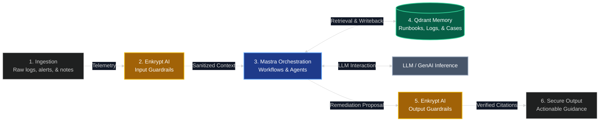

# Runbook Sentinel — Comprehensive Architecture Diagram

This document contains the standalone system and data flow architecture diagram for Runbook Sentinel, showing the full incident lifecycle across **Mastra**, **Qdrant**, and **Enkrypt AI**.

## Incident Lifecycle and Data Flow

### Flow Walkthrough

1.  **Ingestion & Input Sanitization**: The **On-Call Engineer** or **Incident Commander** inputs telemetry data. **Enkrypt AI** evaluates it for prompt injection or sensitive tokens (such as AWS keys or credentials), redacting them before they reach downstream components.
2.  **Triage**: The **Mastra `TriageAgent`** extracts the target service and estimates the incident severity, evaluating whether the incident threatens to breach active **SLOs** or consume the **error budget**.
3.  **Parallel Retrieval**: The **Mastra `RetrievalWorkflow`** initiates parallel search queries across four **Qdrant** collections (`incidents`, `runbooks`, `log_chunks`, and `post_mortems`). For logs, it uses hybrid search (combining dense vector search with sparse BM25 indexing) and Reciprocal Rank Fusion (RRF).
4.  **Re-Ranking**: Results are normalized and updated using chronological decay (prioritizing recent logs/incidents) and service boosts. The top results are sent to the **`RemediationAgent`**.
5.  **Plan Generation**: The **`RemediationAgent`** drafts remediation steps. The Zod output schema requires every recommendation to map to at least one valid source ID in `evidence_refs`.
6.  **Output Sanitization**: The generated plan and the source context are sent to **Enkrypt AI's hallucination and adherence detectors** to ensure that recommendations match verified documentation.
7.  **Human-in-the-Loop Gate**: If any step is flagged as `high_risk`, Mastra suspends execution, saving the state and waiting for the **Incident Commander** to review and approve the step.
8.  **Execution & Writeback**: When approved, execution details are saved to the relational database, and Server-Sent Events update the **Scribe** timeline and **Communications Lead** dashboard. On incident close, the **`PostMortemAgent`** builds a blameless post-mortem draft and writes the verified patterns back to **Qdrant**.

---

## High-Level MVP Integration Flow

For a high-level overview of the Round 1 submission and core MVP scope, the following diagram illustrates the critical path and the central integrations of the mandatory technology stack (**Mastra**, **Qdrant**, and **Enkrypt AI**):

### High-Level Critical Path Walkthrough

1.  **Ingestion**: Raw alert payloads, stack traces, and operator notes are received at the incident room interface.
2.  **Enkrypt AI (Input Guardrails)**: Blocks potential prompt injection attempts and filters out operational secrets (such as API keys and credentials) or customer PII before sending the payload downstream.
3.  **Mastra Orchestration**: Acts as the central workflows and agents orchestrator. It manages execution states, conditions, steps, tools, and the supervisor pattern configuration.
4.  **Qdrant Memory**: Provides vector semantic search capabilities. Mastra queries Qdrant to retrieve relevant runbook chunks and historical incident records.
5.  **Enkrypt AI (Output Guardrails)**: Cross-checks the generated plan against the retrieved Qdrant context to check for hallucinations and evaluate safety before displaying suggestions.
6.  **Secure Output**: Surfaces the verified, citation-grounded remediation recommendations to the engineer.

