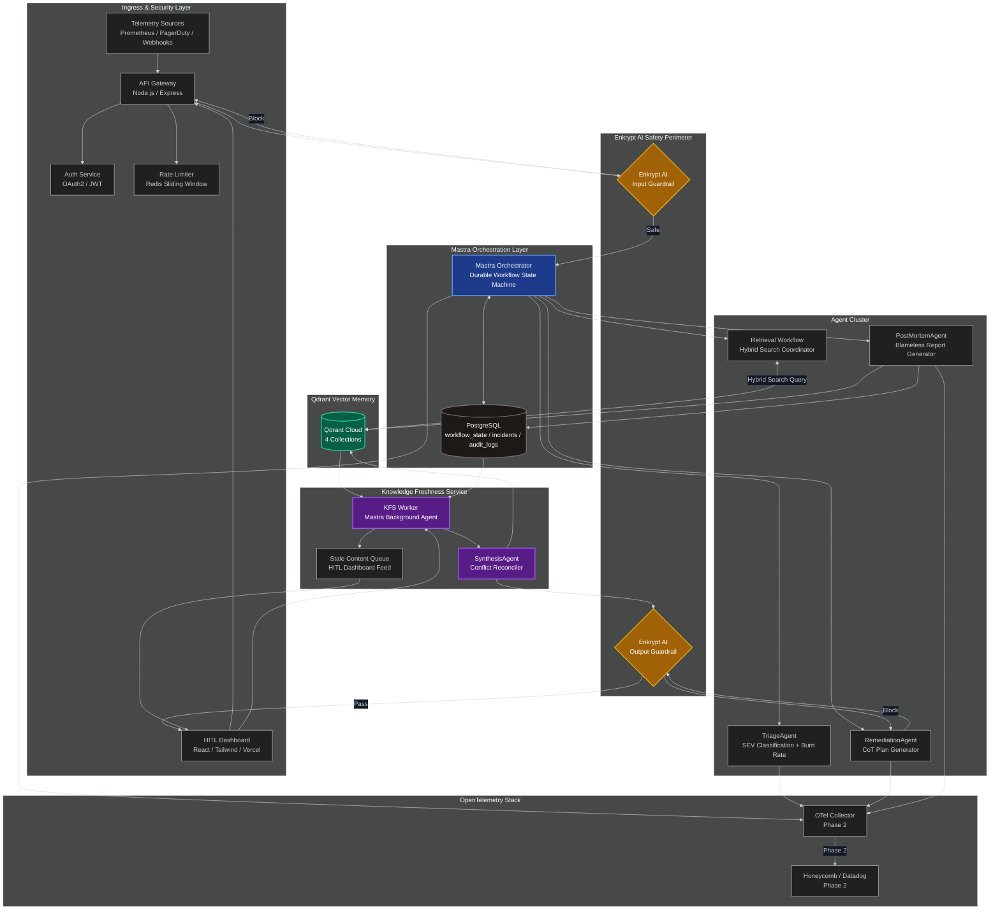
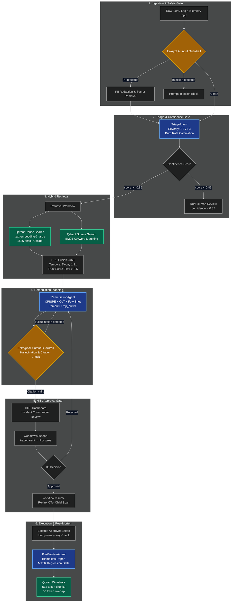
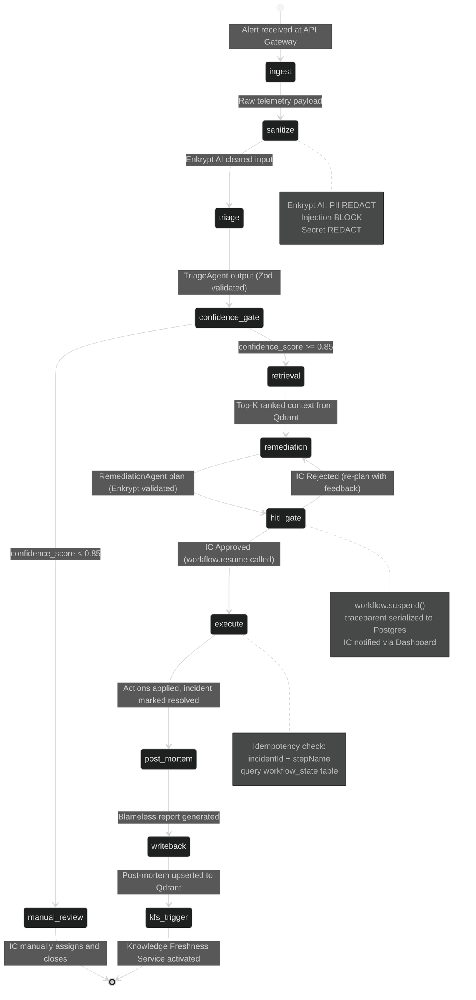
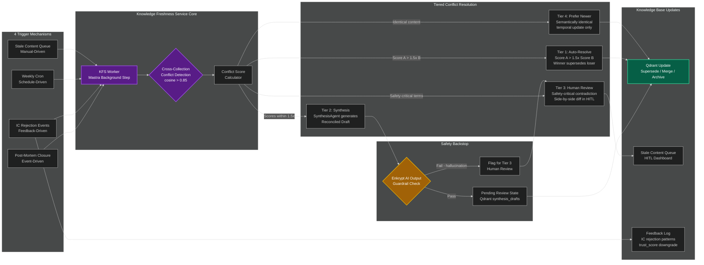
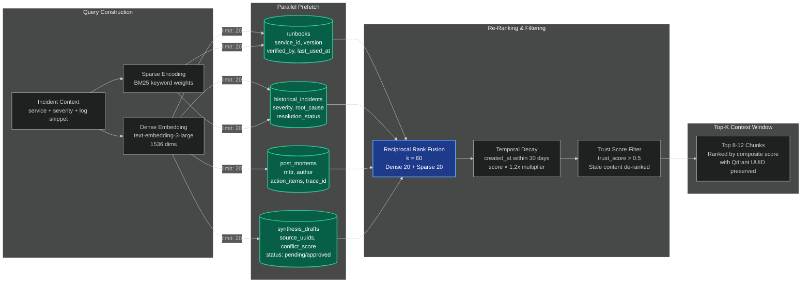
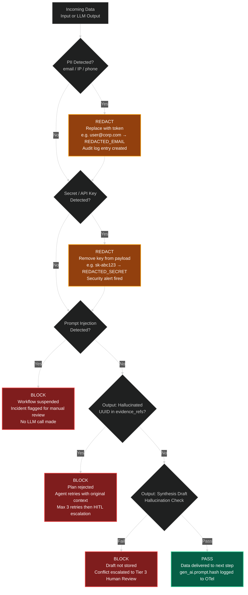
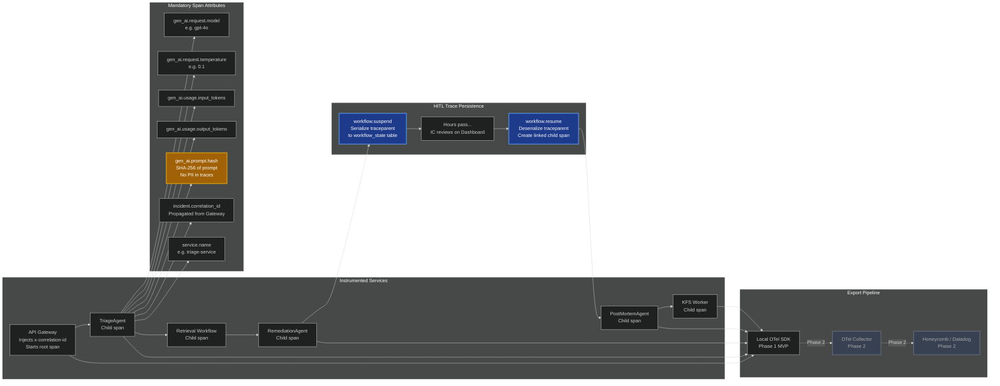
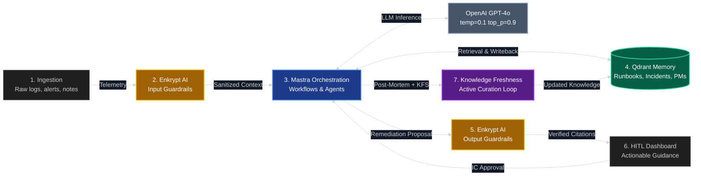

# Runbook Sentinel — Comprehensive Architecture Document
  
**Track:** Track 5 — Incident Response & Post-Mortem Agent  
**Status:** Final Submission  

This document provides the complete system architecture for Runbook Sentinel across seven dedicated diagrams, each covering a distinct layer of the platform. Together they describe the full lifecycle of a production incident — from alert ingestion to institutional knowledge writeback — and the proactive Knowledge Freshness Service that keeps the system's memory accurate over time.

---

## Diagram 1: Full System Architecture Overview

The highest-level view of the platform showing all layers, components, and their relationships.



### Layer Descriptions

| Layer | Components | Responsibility |
|:---|:---|:---|
| **Ingress & Security** | API Gateway, Auth Service, Redis Rate Limiter | Authenticates requests, enforces rate limits, injects `x-correlation-id` |
| **Safety Perimeter** | Enkrypt AI Input + Output | Blocks prompt injection, redacts PII/secrets, validates citations against context |
| **Orchestration** | Mastra Orchestrator, PostgreSQL | Manages durable 10-step workflow state, persists `traceparent` for OTel |
| **Agent Cluster** | Triage, Retrieval, Remediation, PostMortem | Specialized AI agents each with a strict Zod output schema |
| **Vector Memory** | Qdrant Cloud (4 collections) | Hybrid semantic + keyword retrieval across runbooks, incidents, post-mortems |
| **Knowledge Freshness** | KFS Worker, SynthesisAgent, Stale Queue | Proactively detects and resolves conflicts between new and existing knowledge |
| **Observability** | OTel Collector, Honeycomb/Datadog | Captures every LLM span with GenAI semantic conventions |

---

## Diagram 2: Incident Lifecycle — End-to-End Data Flow

The full incident journey from alert trigger to knowledge writeback, showing every agent, safety gate, and decision branch.



---

## Diagram 3: Mastra Workflow State Machine

The deterministic 10-step state machine showing all execution states, transition conditions, and failure branches.



### Step-by-Step State Definitions

| Step | Input | Output | Failure Handling |
|:---|:---|:---|:---|
| `ingest` | Raw webhook/telemetry | Parsed payload | Return 400, log to audit_logs |
| `sanitize` | Raw payload | Cleaned payload | Block and suspend if injection detected |
| `triage` | Cleaned payload | `TriageSchema` (Zod) | If LLM error, retry ×3 then manual_review |
| `confidence_gate` | confidence_score | Branch decision | Below 0.85 always routes to manual_review |
| `retrieval` | Service context | Top-20 RRF chunks | If Qdrant unavailable, continue with empty context + flag |
| `remediation` | Context chunks | `RemediationSchema` (Zod) | If Enkrypt blocks output, retry with reduced temperature |
| `hitl_gate` | Remediation plan | IC decision | Timeout after 4 hours triggers re-escalation alert |
| `execute` | Approved steps | Execution log | Idempotency key prevents duplicate runs |
| `post_mortem` | Full trace | `PostMortemSchema` (Zod) | Draft saved even if MTTR delta query fails |
| `writeback` | Post-mortem doc | Qdrant upsert | Queue for retry if Qdrant write fails |

---

## Diagram 4: Knowledge Freshness Service — Active Curation Flow

The background Mastra worker that prevents knowledge drift by proactively detecting and resolving conflicts between new post-mortems and existing runbooks.



### Conflict Score Formula

Every document pair in conflict is evaluated using a weighted composite score:

```
Score = (1 / days_since_created × 0.4)
      + (approval_rate × usage_count × 0.4)
      + (source_authority × 0.2)

Where:
  days_since_created  = calendar days since document was created
  approval_rate       = fraction of IC approvals citing this document
  usage_count         = number of times retrieved in active incidents
  source_authority    = 1.0 if verified by sre_lead, 0.6 otherwise
```

| Tier | Condition | Resolution | Human Required |
|:---|:---|:---|:---|
| **Tier 1** | Score A > 1.5× Score B | Auto-supersede. Loser tagged `superseded`. | No |
| **Tier 2** | Scores within 1.5× of each other | SynthesisAgent generates reconciled draft, Enkrypt validates, enters `pending_review`. | No (async) |
| **Tier 3** | Safety-critical keywords in conflict | Side-by-side diff surfaced on HITL Dashboard. Options: Keep / Trust PM / Approve Synthesis. | Yes |
| **Tier 4** | Semantically identical, different timestamps | Newer document replaces older. No synthesis needed. | No |

---

## Diagram 5: Qdrant Memory & Hybrid Retrieval Strategy

How Runbook Sentinel queries, ranks, and filters its four Qdrant collections to produce the most relevant and trustworthy context for the RemediationAgent.



### Collection Schema Reference

| Collection | Vector Size | Distance | Key Metadata Fields |
|:---|:---|:---|:---|
| `runbooks` | 1536 | Cosine | `service_id`, `version`, `verified_by`, `last_used_at`, `trust_score` |
| `historical_incidents` | 1536 | Cosine | `severity`, `root_cause`, `resolution_status`, `incident_id`, `mttr` |
| `post_mortems` | 1536 | Cosine | `mttr_delta`, `author`, `action_items`, `trace_id`, `affected_service` |
| `synthesis_drafts` | 1536 | Cosine | `source_uuids`, `conflict_score`, `status` (pending/approved) |

---

## Diagram 6: Enkrypt AI Safety Decision Tree

All possible input and output states, and what action Enkrypt AI takes for each.



---


## Diagram 7: OpenTelemetry Observability Flow

How traces, spans, and GenAI metrics flow from every agent through to the observability backend, including how HITL suspension is handled without breaking trace continuity.



### HITL Trace Continuity Mechanism

The HITL suspension creates a time gap of hours in an incident trace. Rather than keeping an in-memory span open (which would time out or exhaust resources), Runbook Sentinel uses a **Trace Persistence** pattern:

1. **Suspend**: When `workflow.suspend()` is called, the current `traceparent` (W3C format: `00-traceId-spanId-flags`) is serialized and stored in the `workflow_state.traceparent` column in PostgreSQL alongside the workflow checkpoint.
2. **Wait**: The OTel span technically ends here. The trace appears "incomplete" in the backend but the traceId is preserved.
3. **Resume**: When the IC approves via the Dashboard, `workflow.resume()` retrieves the stored `traceparent`, extracts the `traceId`, and starts the next span as an explicit child of the original trace context using the OTel propagation API.
4. **Result**: Honeycomb/Datadog shows a single connected trace for the full incident lifecycle with a visible time gap during the human review window — a feature, not a bug.

---

## High-Level MVP Critical Path

A simplified view of the mandatory hackathon stack integration for the Round 1 submission.



