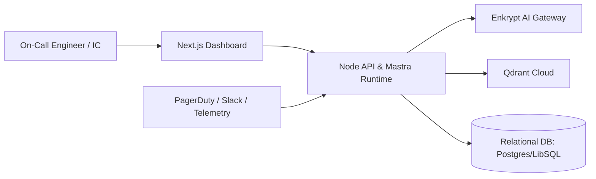
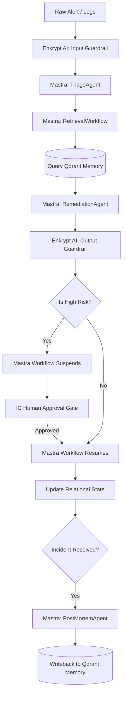
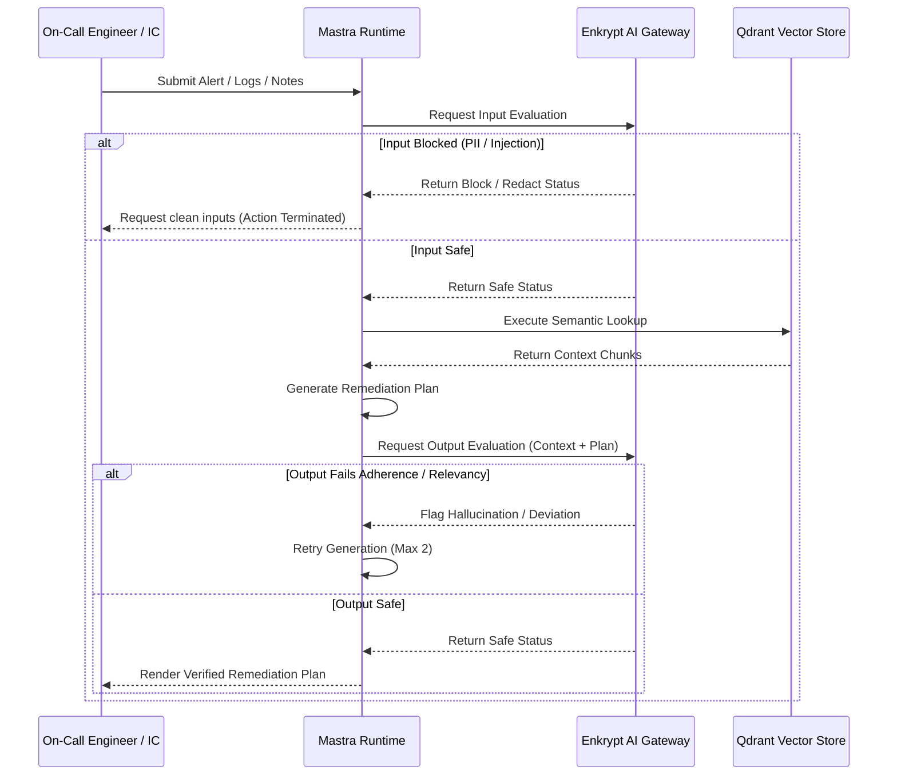
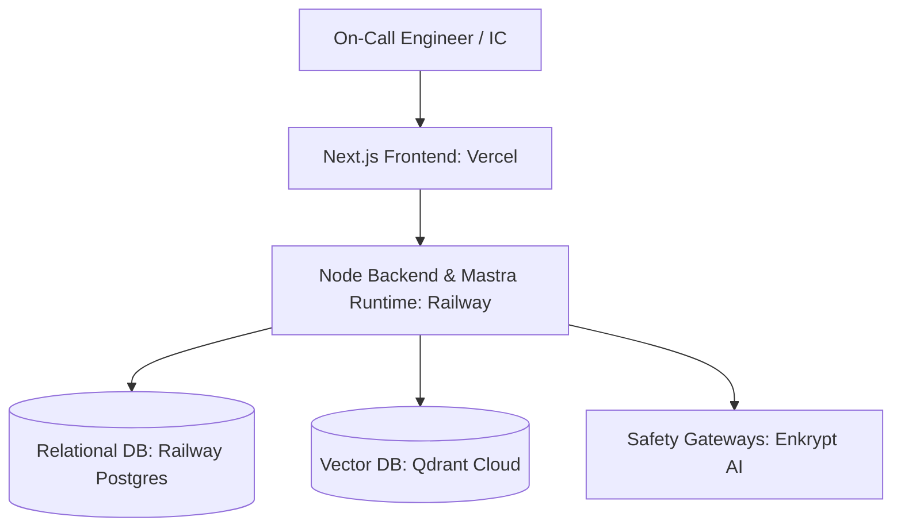

# Runbook Sentinel — Product Requirements Document

## 1. Overview
Runbook Sentinel is an intelligent incident response and post-mortem execution platform built specifically for modern Site Reliability Engineering (SRE) workflows. Integrating agent orchestration via **Mastra**, semantic operational memory using **Qdrant**, and safety-evaluation gating via **Enkrypt AI**, the system streamlines active incident management rather than providing a generic chatbot interface. 

Designed to support engineers during high-pressure **on-call rotations**, Runbook Sentinel acts as an automated assistant that helps triage alerts, retrieve historical institutional knowledge, propose evidence-backed remediation paths, and draft blameless post-mortems. By combining workflow orchestration with vector-based memory, the system ensures that every incident resolved leaves the team with a stronger, more accessible repository of operational knowledge.

---

## 2. Problem Statement
Modern production operations suffer from fragmented incident response environments. When critical **Service Level Objectives (SLOs)** are threatened, engineers must navigate disconnected dashboards, chat histories, code repositories, and wiki articles. Under the pressure of a burning **error budget**, this fragmentation causes several operational failures:

1. **High Alert Fatigue and Low Signal-to-Noise Ratio**: A massive volume of alerts causes responder fatigue. Identifying the root cause amidst high noise in logs and metrics takes too long, slowing the initial **ACK** (acknowledgement) and increasing the **Mean Time to Investigate (MTTI)**.
2. **Context Reconstruction Toil**: Gathering logs, traces, and metrics during an incident is manual, repetitive, and non-trivial. This **toil** scales linearly with the number of incidents and keeps responders from focusing on actual recovery.
3. **Repeated Incidents and Stale Knowledge**: Institutional memory is rarely consulted during active incidents. Prior resolutions, historical timelines, and **distributed tracing** insights are buried in documents that are hard to find under stress.
4. **Ungrounded/Unsafe AI Guidance**: Using generic large language models for production diagnostics introduces severe risks: models hallucinate CLI commands, leak sensitive customer logs/PII, or propose destructive remediation steps without service context.
5. **Delayed or Incomplete Post-Incident Learning**: Writing post-mortems is delayed or skipped because compiling timelines, mapping **contributing factors**, and identifying **corrective actions** requires manual reconstruction of the incident lifecycle.

The primary outcome Runbook Sentinel targets is reducing **Mean Time to Restore (MTTR)**. By starting where monitoring systems end, it automates context collection and retrieval, validates recommendations through a safety firewall, and compiles incident evidence into structured timelines.

---

## 3. Competitive Differentiation
Existing operational tools address parts of the incident lifecycle, but none combine workflow orchestration, vector memory, and safety evaluation into a single learning platform.

| Capability | PagerDuty / Opsgenie | Datadog AI Assistant | Generic LLM Copilots | Runbook Sentinel |
|---|---|---|---|---|
| Alert routing & escalation | ✅ Core function | ✅ Core function | ❌ | Integration-ready (non-goal to replace) |
| Semantic search over past incidents | ❌ | ❌ | ❌ | ✅ Qdrant-backed institutional memory |
| Evidence-backed remediation | ❌ | Partial (dashboard Q&A) | Hallucination-prone | ✅ Citation-enforced with Enkrypt validation |
| Cross-incident learning | ❌ | ❌ | ❌ (stateless) | ✅ Writeback loop compounds knowledge |
| Safety evaluation on outputs | ❌ | ❌ | ❌ | ✅ Enkrypt adherence + hallucination gates |
| Multi-step workflow orchestration | ❌ | ❌ | ❌ | ✅ Mastra workflows with HITL |

**The Core Differentiation**: PagerDuty is a reactive alert router. Datadog AI is a dashboard Q&A tool over current telemetry. Generic LLM copilots are stateless and hallucination-prone. Runbook Sentinel is a **learning system** — it compounds institutional memory through Qdrant writeback, enforces output safety through Enkrypt evaluation, and coordinates multi-step reasoning through Mastra orchestration. Each incident resolved makes the next one faster to mitigate.

---

## 4. Target Users & Incident Roles
The platform defines specific permissions and views based on standard incident command structures:

*   **Primary User: On-Call Engineer**: The first responder paged when a service degrades. Needs immediate, low-noise diagnostic context to lower MTTI, safely perform **mitigation** steps (e.g. running a rollback or adjusting capacity), and avoid alert fatigue.
*   **Incident Commander (IC)**: The leader responsible for overall incident strategy. Manages severe outages (SEV1/SEV2), establishes the **incident channel**, coordinates the **bridge call**, and authorizes high-risk execution steps.
*   **Communications Lead**: Responsible for managing stakeholder and customer communication, translating technical issues into **customer impact** statements and tracking recovery progress.
*   **Scribe**: Historically a manual role dedicated to capturing timeline milestones, decisions, and action items. Runbook Sentinel automates the scribe function by tracking all actions, retrievals, and approvals.
*   **SRE / Platform Engineer**: Configures SLO metrics, designs runbook rules, conducts retrospective reviews, and audits safety logs to verify output compliance.

---

## 5. Product Vision
Runbook Sentinel becomes the decision-support and memory layer for incident response teams. It enables engineers to shift from raw alerts to evidence-backed action quickly while maintaining the validation, safety checks, and human control required in production environments.

---

## 6. Goals & Non-Goals

### Business & Operational Goals
*   Demonstrate a production-grade AI agent architecture using the mandatory hackathon stack as core infrastructure.
*   Achieve measurable decreases in MTTR and MTTI for teams operating complex services.
*   Maintain a high safety compliance record by preventing unsafe commands, hallucinated steps, or sensitive data leaks.
*   Build an operational knowledge base that naturally updates itself with every resolved incident.

### Non-Goals
*   Fully autonomous, un-gated execution of production remediation commands.
*   Replacing observability platforms (Datadog, Grafana) or alert routers (PagerDuty).
*   Supporting natural language queries unrelated to production incident response.

---

## 7. Core Product Narrative
When an alert triggers, the engineer acknowledges (**ACK**) the page and inputs the alert payload, log extract, or trace graph into Runbook Sentinel. Enkrypt AI immediately screens the input for secrets or injections. 

Once cleared, Mastra triggers the `incident-response` workflow, invoking the `TriageAgent` to assess the subsystem and **customer impact**. 

In parallel, Mastra queries Qdrant to retrieve matching runbooks, similar incidents, and historical log signatures. The `RemediationAgent` parses this context and builds a plan categorizing actions into low-risk diagnostic investigations and high-risk mitigations. 

If high-risk steps are proposed (like a **canary deployment** rollback), the workflow suspends, notifying the Incident Commander for approval. 

Once resolved, the `PostMortemAgent` builds a blameless post-mortem draft. Upon approval, the final resolution details are written back to Qdrant, closing the loop to ensure future runs retrieve this new knowledge.

---

## 8. Key Features

### 1. Secure Alert and Incident Intake
*   Accept inputs via copy-pasted log traces, slack alert webhooks, or structured JSON.
*   Sanitize inputs using Enkrypt AI to detect and redact sensitive configurations, access tokens, and PII.

### 2. Triage & SLO Threat Assessment
*   Correlate alerts to a specific service and subsystem.
*   Determine estimated severity (SEV1, SEV2, SEV3) based on customer impact metrics and evaluate the threat of an **SLO** or **SLA** breach.

### 3. Historical Incident Retrieval
*   Query Qdrant semantically to match symptoms, error signatures, and system configurations with historical outages.
*   Filter retrieval context by service, deployment environment, and recency.

### 4. Runbook Retrieval
*   Fetch the exact sections of matching service runbooks to find verified procedures.
*   Extract code commands, dependencies, and diagnostic validation checks.

### 5. Structured Remediation Proposal
*   Present action steps split by risk category: low-risk diagnostic probes, safe mitigations, and high-risk recovery scripts.
*   Enforce evidence citations on every generated step, linking back to the source runbook or incident ID.

### 6. Human-In-The-Loop (HITL) Approval Gates
*   Suspend the Mastra workflow when high-risk actions are recommended.
*   Provide the Incident Commander with a clean approve/reject interface with state preservation.

### 7. Automated Timeline Compilation
*   Build an active timeline tracking alert onset, triage decisions, retrieved suggestions, human approvals, and engineer remarks, eliminating manual scribe toil.

### 8. Post-Mortem & Action Item Generation
*   Draft a comprehensive, blameless post-mortem including timeline, root cause hypotheses, **contributing factors**, **detection gap analysis**, and categorized action items (**corrective**, **detective**, and **process** actions).

### 9. Knowledge Writeback Loop
*   Upsert the finalized post-mortem and verified log patterns back to Qdrant to improve future retrieval context.

---

## 9. User Journeys

### Journey 1: Active SEV2 Triage
1.  An on-call engineer is paged due to a spike in HTTP 5xx responses on `checkout-api`.
2.  The engineer enters the alert payload and a log excerpt into the Runbook Sentinel incident room.
3.  Enkrypt AI verifies the input is safe from injections and filters out database passwords in the logs.
4.  Mastra triggers the response workflow; `TriageAgent` classifies it as a SEV2 incident threatening the service's latency and error rate SLO.
5.  Qdrant returns a runbook detailing a cache stampede mitigation and a similar incident from last month.
6.  The `RemediationAgent` recommends diagnostic checks (checking cache hits) and a mitigation step (flushing the Redis keys).
7.  The engineer applies the suggestion, validates recovery, and marks the incident mitigated.

### Journey 2: SEV1 War Room and Bridge Support
1.  A cascading system outage triggers a SEV1 incident. Responders join an active **bridge call** and open a dedicated **incident channel**.
2.  The Incident Commander feeds evolving symptoms and notes into the system.
3.  Because the incident is flagged as a SEV1, the workflow shifts to higher-severity rules: broadening vector search to dependent services and locking all execution suggestions behind strict IC approval gates.
4.  Runbook Sentinel continuously summarizes timeline events, updates the active hypotheses list, and suggests recovery options.
5.  The IC approves a database connection pool expansion recommendation directly through the interface.
6.  The system records the approval and recovery confirmation automatically, freeing the team from manual timeline logging.

### Journey 3: Retrospective and Memory Writeback
1.  Once the system recovers, the engineer clicks "Close Incident".
2.  Mastra triggers the `post-mortem-generation` workflow, gathering the full timeline, decisions, approvals, and logs.
3.  The `PostMortemAgent` generates a draft identifying the proximate trigger and contributing factors (e.g. database pool exhaustion during a marketing surge).
4.  The draft suggests corrective actions (autoscaling policies) and detective actions (adding pool saturation metrics).
5.  The engineer reviews, edits, and approves the post-mortem.
6.  Mastra pushes the structured summary and relevant log signatures into Qdrant, ensuring subsequent search runs can recall this outage pattern.

---

## 10. Architecture Overview

### 10.1 Architecture Principles
1.  **Retrieval-Enforced Actionability**: No remediation plan can be shown to an engineer unless it is backed by citations linked directly to verified runbooks or historical cases.
2.  **Strict State Auditing**: Every transition of the incident status, safety check, and human approval must be saved sequentially.
3.  **Tiered Context Routing**: Session context (conversations, immediate triage data) is handled by fast memory tiers; long-term organizational memory is isolated in a vector database.
4.  **TypeScript Integration**: The codebase uses TypeScript from end to end across Next.js components, API routers, Mastra agent schemas, and vector payload structures.

### 10.2 System Context
The context diagram below represents how responders, web applications, and backend services interact with the three core technologies:



### 10.3 High-Level Data Flow
The sequence of operational processing shows how a incoming raw alert is processed, evaluated, resolved, and committed to memory:



---

## 11. Mastra Orchestration Layer

### 11.1 Agent Design
The platform uses four distinct, highly specialized agents configured within the Mastra runtime.

| Agent | Responsibility | Inputs | Outputs |
|---|---|---|---|
| `TriageAgent` | Performs initial assessment, service mapping, severity categorization, and SLO threat classification. | Raw alert telemetry, system logs, engineer notes. | Structured triage summary, target service, severity classification, SLO impact risk. |
| `RetrievalAgent` | Converts triage context into vector queries, gathers evidence across Qdrant collections, and re-ranks results. | Structured triage summary. | Ranked array of similar incidents, runbook passages, log patterns, and post-mortems. |
| `RemediationAgent` | Proposes a split remediation plan containing diagnostic steps and recovery steps. Enforces evidence linking. | Triage details, re-ranked retrieval context. | Action plan containing steps, risk ratings, rationales, and mandatory `evidence_refs`. |
| `PostMortemAgent` | Builds a comprehensive post-incident review draft, focusing on blameless analysis. | Incident timeline logs, notes, approval records, original alert payload. | Retrospective draft, action items, search writeback payload. |

### 11.2 Citation & Evidence Linking
To prevent LLM hallucination, the `RemediationAgent` is configured with a structured output schema that requires a non-empty array of source references for every recommendation.

```typescript
import { z } from 'zod';

const remediationOutputSchema = z.object({
  steps: z.array(z.object({
    action: z.string().describe('The command to execute or check to perform'),
    risk_level: z.enum(['diagnostic', 'mitigating', 'high_risk'])
      .describe('Classification of risk on active operations'),
    rationale: z.string().describe('Operational justification for this step'),
    confidence: z.number().min(0).max(1).describe('Confidence score of this action solving the problem'),
    evidence_refs: z.array(z.string()).min(1)
      .describe('Array of IDs linking to Qdrant runbook chunks or past incident records'),
  })),
  overall_hypothesis: z.string().describe('The primary theory behind this failure pattern'),
});
```

Compliance with this schema is validated by Mastra using Zod. If the LLM generates a step without an evidence ID, validation fails, and the agent triggers an internal retry. In the frontend, the `evidence_refs` are parsed and converted to clickable references within the panel, linking the engineer directly to the source documentation.

### 11.3 Tools
Mastra agents leverage a set of targeted TypeScript tools to read and write to downstream services:

1.  `fetchDashboardLinks`: Generates URLs pointing to Grafana/Datadog dashboards for the targeted service.
2.  `queryIncidentMemory`: Performs semantic lookup on the Qdrant `incidents` and `post_mortems` collections.
3.  `queryRunbookMemory`: Performs semantic lookup on the Qdrant `runbooks` collection.
4.  `appendIncidentTimeline`: Appends a structured record (action, author, outcome, timestamp) to the SQL timeline database.
5.  `submitForApproval`: Triggers a state change and suspends the workflow run, waiting for manual authorization.
6.  `storeResolvedIncident`: Commits the final post-mortem and validated logs to Qdrant at incident closure.

### 11.4 Workflows
Mastra coordinates multi-step operational logic using typed, durable workflows.

#### 1. `incident-response`
*   **Purpose**: Orchestrate the flow from raw alert input to verified remediation guidance.
*   **Execution Steps**:
    1.  Ingest incident telemetry.
    2.  Execute Enkrypt Input Guardrail. If input is blocked, notify the user and exit.
    3.  Run `TriageAgent` to extract service and severity.
    4.  Execute the `evidence-retrieval` workflow.
    5.  Run `RemediationAgent` to construct the ranked remediation steps.
    6.  Execute Enkrypt Output Guardrail. If validation fails (e.g., hallucination flagged), retry generation up to 2 times.
    7.  Evaluate risk: if any step is flagged `high_risk`, trigger Mastra's `suspend()` function, passing the step details to save workflow state in the database.
    8.  Resume when the API receives an approval payload. If approved, append details to the SQL timeline; if rejected, rerun remediation generation with the rejection feedback.

#### 2. `evidence-retrieval`
*   **Purpose**: Assemble context from multiple Qdrant collections in parallel.
*   **Execution Steps**:
    1.  Convert triage properties into search inputs.
    2.  Query `incidents`, `runbooks`, `log_chunks`, and `post_mortems` collections in parallel.
    3.  Normalize similarity scores across collections to a standard `[0, 1]` range.
    4.  Apply metadata boosts: service match (+0.15 boost) and severity match (+0.10 boost).
    5.  Apply chronological decay: multiply score by an exponential decay factor (half-life of 90 days) to prioritize recent incident patterns.
    6.  Combine, sort, slice the top 15 results, and output them to the parent workflow.

#### 3. `post-mortem-generation`
*   **Purpose**: Compile the timeline and generate a blameless post-mortem draft.
*   **Execution Steps**:
    1.  Monitor incident state for a `resolved` status update.
    2.  Query all timeline logs, action logs, and engineer comments from the SQL database.
    3.  Invoke `PostMortemAgent` to compile the retrospective.
    4.  Scan output with Enkrypt AI for safety compliance.
    5.  Save the generated text block as an editable draft.
    6.  Upon final submission, execute `storeResolvedIncident` to write back the finalized knowledge to Qdrant.

### 11.5 Supervisor Agent Pattern
Mastra supports multi-agent setups via the **Supervisor Agent** pattern. In this structure, subagents are declared on the supervisor's `agents: {}` property, and the supervisor routes incoming tasks using `stream()` or `generate()`. 

> **Agent vs Workflow — Round 1 Reconciliation**: In Round 1, the `RetrievalAgent`'s logic is implemented as the `evidence-retrieval` workflow — deterministic, stepwise, and without an LLM intermediary — because retrieval is a mechanical process (embed, query, normalize, rank) that doesn't benefit from LLM decision-making. The agent table in Section 11.1 defines the *logical role*; the workflow in Section 11.4 defines the *Round 1 implementation*. In Round 2, the supervisor pattern calls `RetrievalAgent` directly, delegating query strategy to the LLM when dynamic re-querying is needed mid-incident.

To maintain strict traceability during Round 1, Runbook Sentinel uses **workflows** as the explicit orchestration layer. However, the architecture is designed to evolve into a Supervisor configuration for Round 2, where an `IncidentSupervisorAgent` routes dynamically between subagents based on incident conditions:

```typescript
import { Agent } from '@mastra/core';
import { openai } from '@ai-sdk/openai';

const incidentSupervisor = new Agent({
  name: 'incident-supervisor',
  description: 'Supervisor responsible for managing incident response steps.',
  instructions: `You coordinate incident response. Route to triage-agent first,
    then retrieval-agent for evidence, then remediation-agent for action plans.
    Route to postmortem-agent only after incident resolution.`,
  model: openai('gpt-4o'),
  agents: {
    triageAgent,      // name: 'triage-agent', has description
    retrievalAgent,   // name: 'retrieval-agent', has description
    remediationAgent, // name: 'remediation-agent', has description
    postMortemAgent   // name: 'postmortem-agent', has description
  },
});

// Supervisor delegates tasks; Mastra converts subagents to tools named 'agent-<key>'
const result = await incidentSupervisor.stream(incidentContext, { maxSteps: 15 });
```

This setup allows the supervisor to use the subagents' descriptions to decide when and how to delegate, providing the flexibility to loop back to the `retrievalAgent` if new symptoms appear mid-incident.

### 11.6 Mastra Memory vs Qdrant Memory
The platform separates transient, session-level incident state from long-term, cross-incident knowledge.

```
┌────────────────────────────────────────────────────────┐
│               RUNBOOK SENTINEL MEMORY SYSTEM           │
├───────────────────────────┬────────────────────────────┤
│   MASTRA MEMORY           │   QDRANT VECTOR STORE      │
│   (Session-Level / Fast)  │   (Institutional / Global) │
├───────────────────────────┼────────────────────────────┤
│ * Active incident thread  │ * Multi-collection store   │
│ * Structured working Zod  │ * Historical incident logs │
│ * Message semantic recall │ * Service runbooks         │
│ * Pauses during execution │ * Post-mortems (Writeback) │
└───────────────────────────┴────────────────────────────┘
```

Mastra maintains thread-scoped **Working Memory** to persist current incident details:

```typescript
const incidentWorkingMemory = z.object({
  severity: z.enum(['SEV1', 'SEV2', 'SEV3']).optional()
    .describe('Current severity classification from TriageAgent'),
  affectedService: z.string().optional()
    .describe('Primary service identified as the incident source'),
  blastRadiusHypothesis: z.string().optional()
    .describe('Current best hypothesis for customer and system impact'),
  approvalStatus: z.enum(['pending', 'approved', 'rejected', 'not_required']).optional()
    .describe('HITL approval state for high-risk remediation steps'),
  timelineEventCount: z.number().default(0)
    .describe('Running count of events appended to the incident timeline'),
  activeHypotheses: z.array(z.string()).default([])
    .describe('Ranked list of root cause hypotheses under investigation'),
});
```

Qdrant, conversely, acts as the global knowledge base that persists indefinitely across all incidents and on-call teams.

### 11.7 Why Mastra Matters Here
Mastra provides the core execution guarantees needed for production incident response:
1.  **Durable Workflow Execution**: Ensures that when a workflow suspends for human approval, the engine saves the execution state. It can resume hours later without losing data or context.
2.  **Mastra Studio Developer Tooling**: During development and testing, Mastra Studio (accessible at `localhost:4111`) provides visual execution trees, trace logs, and time-travel debugging. This allows the team to trace exactly how the `RemediationAgent` generated a plan or view why a specific Qdrant chunk was selected.

---

## 12. Qdrant Memory & Retrieval Layer

### 12.1 Collections & Payload Schemas
Qdrant hosts four separate collections, each representing a specific domain:

#### `incidents`
```json
{
  "id": "inc_2026_001",
  "service": "checkout-api",
  "environment": "prod",
  "severity": "SEV2",
  "summary": "Spike in database pool errors after backend deploy",
  "symptoms": ["database_pool_exhausted", "504_gateway_timeout"],
  "resolution": "Rollback checkout-api to v1.4.1 and reset connection pools",
  "timestamp": "2026-06-18T09:10:00Z"
}
```

#### `runbooks`
```json
{
  "id": "rb_checkout_rollback_01",
  "service": "checkout-api",
  "title": "Checkout Rollback and Recovery Procedure",
  "section": "rollback_canary_steps",
  "source": "wiki_operations_checkout",
  "text": "Identify the failing canary target. Run 'kubectl rollout undo deployment/checkout-api-canary' and verify the error rate drops before applying to the primary deployment."
}
```

#### `log_chunks`
```json
{
  "id": "log_2026_06_18_001",
  "incident_id": "inc_2026_001",
  "service": "checkout-api",
  "environment": "prod",
  "error_signature": "db_pool_exhaustion",
  "time_window": "2026-06-18T09:00Z/2026-06-18T09:05Z",
  "log_text": "Error: Timeout acquiring connection from pool 'pg-connection-pool' after 15000ms. Active: 100, Idle: 0, Pending: 87"
}
```

#### `post_mortems`
```json
{
  "id": "pm_2026_001",
  "incident_id": "inc_2026_001",
  "service": "checkout-api",
  "root_cause": "Database connection pool exhaustion caused by unindexed query on new checkout endpoint",
  "timeline": "09:00 Alert fired; 09:02 Acknowledged by on-call; 09:08 Rollback initiated; 09:13 Traffic recovered",
  "action_items": ["Add index to transaction_id on orders table", "Add alert rule for connection pool saturation > 80%"]
}
```

### 12.2 Retrieval Strategy & Embedding Model
*   **Embedding Model**: `text-embedding-3-large` (3072 dimensions, configured with cosine distance) is selected to capture the complex relationships in operational terminology.
*   **Vector Search Patterns**: Lookups combine dense embeddings with structured metadata filtering (exact match on `service`, `environment`, and severity criteria).

### 12.3 Hybrid Search for Log Data
Log lines contain exact tokens like error codes (`db_pool_exhaustion`) or status indicators that dense embeddings might smooth over. 

To prevent this, the `log_chunks` collection utilizes Qdrant’s **hybrid search** capability. The universal query API triggers a dense query and a sparse query (using BM25 indexing) in parallel, fusing them with **Reciprocal Rank Fusion (RRF)**:

```typescript
const results = await qdrantClient.query('log_chunks', {
  prefetch: [
    { query: denseEmbeddingVector, using: 'dense', limit: 20 },
    { query: { indices: sparseIndices, values: sparseValues }, using: 'sparse', limit: 20 },
  ],
  filter: {
    must: [
      { key: 'service', match: { value: serviceName } }
    ]
  },
  fusion: 'rrf',
  limit: 10,
});
```

This approach returns exact keyword matches alongside semantically related log behaviors.

### 12.4 Chunking Strategy
*   **Runbooks**: Chunked logically by document section rather than arbitrary character lengths. Typical size is ~512 tokens with a 64-token overlap, retaining title and source context.
*   **Logs**: Grouped by time window (e.g. 5-minute segments) and filtered by unique error signatures. Chunk size is ~128 tokens, omitting session tokens and IDs.
*   **Post-Mortems**: Chunked by structural fields (Timeline, Root Cause, Lessons Learned) at ~256 tokens per chunk, maintaining metadata links to the main incident record.

### 12.5 Write Path
When an incident is resolved and the post-mortem is signed off, the writeback tool formats the timeline, resolution, and post-mortem files, creates their vector embeddings, and upserts them to Qdrant. This ensures the historical dataset expands automatically.

### 12.6 Mastra + Qdrant Integration
Initialization uses the `@mastra/qdrant` client during application startup:

```typescript
import { QdrantVector } from '@mastra/qdrant';

const incidentStore = new QdrantVector({
  url: process.env.QDRANT_URL!,
  apiKey: process.env.QDRANT_API_KEY,
  https: true,
});

// Configure vector spaces on startup
await incidentStore.createIndex({ indexName: 'incidents', dimension: 3072, metric: 'cosine' });
await incidentStore.createIndex({ indexName: 'runbooks', dimension: 3072, metric: 'cosine' });
await incidentStore.createIndex({ indexName: 'post_mortems', dimension: 3072, metric: 'cosine' });

// Build payload indexes for metadata filtering
await incidentStore.createPayloadIndex({ indexName: 'incidents', fieldName: 'service', fieldSchema: 'keyword' });
await incidentStore.createPayloadIndex({ indexName: 'incidents', fieldName: 'severity', fieldSchema: 'keyword' });
await incidentStore.createPayloadIndex({ indexName: 'incidents', fieldName: 'environment', fieldSchema: 'keyword' });
await incidentStore.createPayloadIndex({ indexName: 'runbooks', fieldName: 'service', fieldSchema: 'keyword' });
await incidentStore.createPayloadIndex({ indexName: 'post_mortems', fieldName: 'incident_id', fieldSchema: 'keyword' });

// log_chunks uses Qdrant client directly (hybrid search with named vectors)
await qdrantClient.createPayloadIndex('log_chunks', { field_name: 'service', field_schema: 'keyword' });
```

---

## 13. Enkrypt AI Safety & Evaluation

### 13.1 Evaluation Pipeline
Enkrypt AI serves as a security gateway for both inputs and outputs:



### 13.2 Input Guardrails
The `incident_input_guardrail` verifies incoming text before downstream reasoning begins.
*   **Prompt Injection Detection**: Blocks attempts to override the system's operational instructions.
*   **PII & Secret Detection**: Scans incoming log files and redacts AWS keys, passwords, database URLs, and credit card numbers before they are sent to the LLM or stored in Qdrant.

### 13.3 Output Guardrails
The `incident_output_guardrail` runs after generation to verify recommendation safety and grounding:
*   **Adherence**: Validates the recommendation against the retrieved Qdrant context (runbooks and past incidents). This checks if the suggested commands exist in the source material.
*   **Hallucination Detection**: Evaluates the input request, the retrieved context, and the proposed response. It flags recommendations that introduce ungrounded assumptions.
*   **Relevancy**: Checks that the generated advice addresses the specific service and symptoms identified during triage.
*   **Toxicity / Policy Compliance**: Verifies that the language remains blameless and professional.

### 13.4 Guardrail Configuration
Guardrails are registered in the Enkrypt AI dashboard. The backend calls the corresponding API endpoints using saved configurations:

```typescript
// Example call to Enkrypt AI Guardrails API
const response = await fetch('https://api.enkryptai.com/v1/guardrails/evaluate', {
  method: 'POST',
  headers: {
    'Content-Type': 'application/json',
    'Authorization': `Bearer ${process.env.ENKRYPTAI_API_KEY}`,
  },
  body: JSON.stringify({
    guardrail_id: 'incident_output_guardrail',
    text: generatedPlanText,
    context: retrievedContextText,
  }),
});
```

### 13.5 Auditability
The application stores every safety validation in the SQL database, including the incident ID, timestamp, detector scores, guardrail status (pass/fail), and any redacted terms. This provides a clear audit log of the system's decisions.

---

## 14. Frontend & UX Architecture
The frontend is built using Next.js and React, prioritizing a structured incident response dashboard over a basic chat view.

### Primary Screens
1.  **Incident Room**: The main dashboard. Features a header with the current status (Triaged / Mitigating / Resolved) and severity. Displays the active timeline, retrieved runbook snippets, the recommended action plan, and the pending approval queue.
2.  **Timeline View**: A chronological log tracking the incident lifecycle: alert trigger times, triage decisions, actions taken, and comments from the team.
3.  **Evidence Panel**: Shows the source material retrieved from Qdrant, including runbooks and log signatures.
4.  **Post-Mortem Editor**: An interactive markdown editor where engineers can review and update the auto-generated retrospective before final submission.

### Frontend Responsibilities
*   Maintain Server-Sent Event (SSE) connections to display real-time updates from active workflows.
*   Display safety evaluation logs from Enkrypt AI for transparency.
*   Highlight citation links on all recommended actions, opening the corresponding runbook section when clicked.
*   Manage human approval states, changing the UI state when actions are pending approval.

---

## 15. Backend & API Surface
The backend service hosts the application API and the Mastra runtime, managing incident state and data routing.

### Relational Database Schema (Postgres / LibSQL)
*   `incidents`: Core incident records (ID, status, severity, service, timestamps).
*   `incident_events`: The event timeline log.
*   `approvals`: Track pending and completed approval steps.
*   `workflow_runs`: Mastra execution logs and workflow run IDs.
*   `enkrypt_evaluations`: Safety check records and validation scores.

### API Endpoints
*   `POST /api/incidents`: Register a new incident.
*   `POST /api/incidents/:id/workflows`: Trigger the `incident-response` workflow.
*   `POST /api/workflows/:runId/resume`: Resume a workflow suspended for human approval.
*   `GET /api/incidents/:id`: Fetch current incident status and active hypotheses.
*   `GET /api/incidents/:id/timeline`: Retrieve the chronological event log.
*   `POST /api/incidents/:id/approve-step`: Approve or reject a recommended step.
*   `POST /api/incidents/:id/postmortem`: Generate or update the post-mortem draft.
*   `POST /api/incidents/:id/finalize`: Complete the incident and run the Qdrant writeback loop.

---

## 16. Deployment Architecture



### Deployment Split
*   **Frontend**: Hosted on **Vercel** for fast page loads and response times.
*   **API & Mastra Runtime**: Hosted on **Railway**. Railway supports the long-running processes required to persist Mastra workflow states and handle suspend/resume logic.
*   **Database**: Postgres managed through Railway, keeping relational storage close to the execution layer.
*   **Vector Database**: Hosted on managed **Qdrant Cloud** clusters.

---

## 17. Observability & Reliability

### Agent Platform Observability
The platform monitors its own performance using the **Four Golden Signals**:
1.  **Latency**: Tracks workflow execution duration, re-ranking latency, and vector search response times.
2.  **Traffic**: Measures active incident runs per hour and concurrent workflow executions.
3.  **Errors**: Logs Enkrypt validation failures, workflow execution errors, and database connection timeouts.
4.  **Saturation**: Monitors the workflow execution queue and relational database connection pools.

### Failure Handling
*   **Degraded Retrieval Fallback**: If the retrieval step falls below the target confidence threshold (precision@5 < 0.80), the system flags the issue in the UI, falls back to a limited recommendation set, and alerts the engineer to perform manual verification.
*   **Workflow Resiliency**: If a network error occurs during a workflow run, Mastra's state persistence ensures the execution can resume from the last completed step.

---

## 18. MVP Scope

### In-Scope for Hackathon MVP
*   Incident creation from pasted alerts or manual input.
*   Triage analysis and workflow branching based on severity.
*   Semantic retrieval from seeded Qdrant collections (incidents, runbooks, logs, post-mortems).
*   Evidence-backed remediation plans with mandatory citations.
*   HITL approval flow for high-risk steps.
*   Automated incident timeline generation.
*   Blameless post-mortem draft creation.
*   Enkrypt AI safety evaluations for inputs and outputs.

### Out-of-Scope
*   Fully automated, un-gated updates to production infrastructure.
*   Multi-tenant enterprise access management.
*   Direct integrations with all telemetry providers.

---

## 19. Demo & Seed Data Strategy
To demonstrate the platform's capabilities, the project includes a seeded test environment with mock production data.

### Seed Dataset
We seed 10 to 20 historical incidents across five core mock services:
1.  `checkout-api`: Handles checkout operations.
2.  `payments-worker`: Processes transactions.
3.  `catalog-api`: Manages product listings.
4.  `auth-service`: Handles user authentication.
5.  `redis-cache`: Caches database query results.

Each record includes severity flags, timelines, log patterns, and the verified resolution.

### Seed Runbooks
Runbooks are seeded for common failure scenarios:
*   Canary deployment rollbacks.
*   Redis cache stampede mitigation.
*   Database connection pool exhaustion.
*   Third-party payment gateway timeouts.
*   Message queue backlog recovery.

### Mock Telemetry & Logs
The seed script populates log entries containing JSON-formatted fields, error signatures, trace IDs, and HTTP status codes, simulating a microservices environment.

### Golden Demo Scenario
We demonstrate the system using a database connection pool exhaustion incident on the `checkout-api` service:
1.  An alert triggers due to elevated 5xx error rates on `checkout-api`.
2.  The engineer copies the alert log and opens the Runbook Sentinel workspace.
3.  The system identifies database connection pool exhaustion as the issue.
4.  It retrieves a matching cache stampede runbook and a past incident showing a similar failure pattern.
5.  The system recommends checking the cache hit rate (low-risk) and running a connection pool reset (high-risk).
6.  The IC approves the high-risk step.
7.  The system records the recovery, generates a blameless post-mortem draft, and runs the writeback loop to update Qdrant.

---

## 20. Success Metrics

### Product Metrics
*   **MTTR Reduction**: Reduction in time from incident acknowledgment to service restoration, measured against a baseline manual process on the same incident scenarios (Target: ≥ 20% reduction on seeded P75 incident scenarios).
*   **Time to First Recommendation (P75)**: Time from incident intake to the first validated remediation proposal (Target: P75 < 8 seconds).
*   **Retrieval Response Time**: Latency of semantic queries to Qdrant (Target: P75 < 3 seconds).
*   **Post-Mortem Coverage**: Percentage of resolved incidents with an automatically drafted post-mortem within 5 minutes (Target: ≥ 90%).

### Quality Metrics
*   **Retrieval Precision@5**: Relevance of the top-5 search results against our evaluation dataset (Target: ≥ 0.80).
*   **Enkrypt First-Pass Rate**: Percentage of outputs passing safety checks without requiring regeneration (Target: ≥ 85%).
*   **Citation Compliance**: Enforced at 100% via schema validation; all recommendations must contain source references.

### User Metrics
*   **Recommendation Usefulness**: Average rating from engineers on a 1-5 scale (Target: ≥ 3.8).
*   **Post-Mortem Acceptance**: Percentage of drafts accepted with only minor edits (Target: ≥ 70%).

---

## 21. Risks & Mitigations

### Hallucinated Remediation Steps
*   *Risk*: The LLM recommends incorrect or dangerous command syntaxes.
*   *Mitigation*: We enforce citation compliance via the Zod output schema and run Enkrypt AI adherence checks to verify suggestions match the retrieved runbooks.

### Hallucination Detection on Degraded Retrieval
*   *Risk*: The hallucination detector checks consistency against the retrieved context. If the search results are incorrect or stale, a recommendation could pass the hallucination check but still provide incorrect advice.
*   *Mitigation*: We enforce a precision@5 threshold gate. If search relevance scores fall below 0.80, the system flags the degradation, limits recommendations, and prompts the engineer to verify the steps manually.

### Sensitive Data Leakage
*   *Risk*: User logs can contain keys or sensitive customer details, which could be sent to public APIs or stored in database indexes.
*   *Mitigation*: We run Enkrypt AI input checks to detect and redact credentials and PII before processing.

---

## 22. Future Expansion
*   **Webhook Integrations**: Automate alert intake from tools like PagerDuty and Prometheus.
*   **Incident Channel Sync**: Automatically update Slack incident channels with timeline events.
*   **Interactive Log Analysis**: Provide tools to query active log streams directly from the workspace.
*   **Automated Verification Checks**: Add tools to verify if a mitigation step successfully resolved the target issue.

---

Runbook Sentinel is designed around realistic SRE requirements, providing a structured, verifiable approach to incident response.
